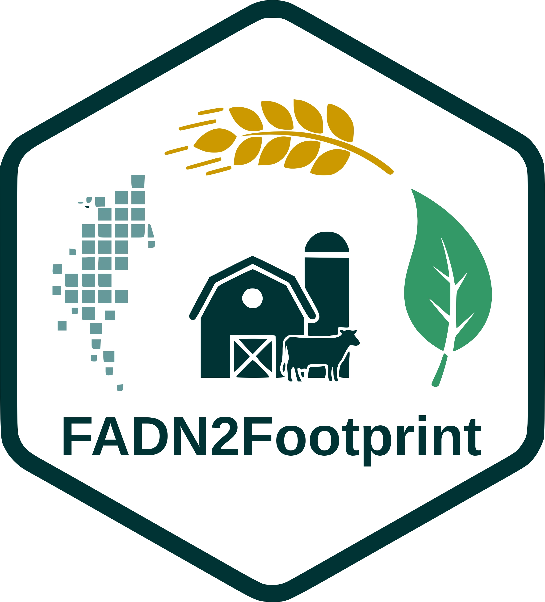

```{r setup, include=FALSE}
knitr::opts_chunk$set(
  collapse = TRUE,
  comment  = "#>",
  eval     = FALSE
)
library(dplyr)
library(tidyr)
library(readxl)
library(gt)

library(FADN2Footprint)

```

Sarah HUET, Kassoum AYOUBA & Valentin BELLASSEN

[sarah.huet\@inrae.fr](mailto:sarah.huet@inrae.fr){.email}
[valentin.bellassen\@inrae.fr](mailto:valentin.bellassen@inrae.fr){.email}

[FADN2Footprint Home Page](http://sarah-huet.github.io/FADN2Footprint/)

If you use FADN2Footprint, please
acknowledge and cite FADN2Footprint in your publications:

**FADN2Footprint: an R package to infer agricultural practices and
compute farms environmental footprints from FADN data**. Huet, Ayouba &
Bellassen (in prep.)



This package depends on R (>= 4.1.0).

--------------------------------------------------------------------------------
/!\ CAUTION /!\
This package have been tested for cereals and milk productions.
Make sure you filter farms in field crops and dairy farming types.
Estimates for other productions are not reliable yet.
--------------------------------------------------------------------------------

# Overview

The FADN2Footprint package provides a standardized framework for
transforming raw FADN microdata (EU FADN or national FADN extracts) into
a standardized internal representation that can be used to compute:

-   Farm practice indicators (e.g., fertilizer quantity/quality,
    pesticide use, tillage intensity, crop diversity, yields, hedge
    density, ground cover, livestock density, feed intake, manure
    systems, etc.)

-   Environmental footprints (e.g., greenhouse gas emissions,
    biodiversity impacts, water consumption/pollution)

-   Economic performance (e.g., price premium, added value, operating
    margin, labour-to-product ratio)

-   Social performance (e.g., generational renewal, farmer education)

FADN2Footprint bridges the gap between farm-level accounting data and
sustainability assessment by:

-   Harmonizing heterogeneous FADN data sources (EU-wide or national)

-   Inferring agricultural practices

-   Estimating greenhouse gas emissions, biodiversity impacts, water
    use, and socioeconomic indicators

-   Informing multiple scales: country, NUTS2, farm, activity, and
    product-level analysis

The package follows a life cycle assessment (LCA) spirit with Scope 3
boundaries.

The core entry point is the S4 class `FADN2Footprint`, created with the
constructor function `data_4FADN2Footprint()`.

# The FADN2Footprint S4 class

At the heart of the package is the `FADN2Footprint` S4 class, which
stores your input data, intermediate calculations, and final results in
a structured, traceable manner.

A `FADN2Footprint` object is an S4 container that stores:

-   Parsed “internal tables” derived from your raw farm-year dataset
    (still linked by identifiers): farm, crop, herd, input, and output
    tables,

-   Optional landscape metrics (hedges, mean field size, ground cover,
    etc.),

-   “Empty-by-default” slots for agricultural practice indicators and
    footprint results (to be filled by later modules),

-   A traceability log that records key transformations applied during
    construction (e.g., identifier variable names, column removal,
    variable mapping decisions, detected naming scheme).

The constructor returns an S4 instance with (at least) the following
slots:

| Slot                | Description                                 | Status After Construction      |
|-------------------|-------------------------------|-----------------------|
| `farm`              | Farm characteristics (size, location, type) | Parsed from input data         |
| `crop`              | Crop area, production, yield, sales         | Parsed from input data         |
| `herd`              | Livestock herd data                         | Parsed from input data         |
| `input`             | Input use (fertilizers, pesticides, energy) | Parsed from input data         |
| `output`            | Production outputs and yields               | Parsed from input data         |
| `landscape_metrics` | User-provided landscape data                | As provided (or `NULL`)        |
| `practices`         | Practice indicators                         | Inferred                       |
| `footprints`        | Environmental/economic footprints           | Inferred                       |
| `traceability`      | Data processing logs                        | Populated with mapping details |

# Building a FADN2Footprint Object

Constructing a valid `FADN2Footprint` object requires three main steps:

1.  Prepare your data and your variable dictionary to map your column
    names to the package's standard

2.  Call the constructor function `data_4FADN2Footprint()`

3.  Inspect and validate the resulting object

## What you need to build an object

To build a `FADN2Footprint` object you need:

-   A raw FADN data.frame at farm-year level (wide format)

-   A set of identifier columns (id_cols) that must include at least:
    "ID", "YEAR", "COUNTRY"

-   A variable dictionary (var_dict) that maps your dataset column names
    (EU/national extract) to the package’s internal “common” names
    (var_common)

-   Optionally: A landscape_metrics data.frame (e.g., hedge density,
    mean field size, ground cover), which is stored and can be used
    later to compute landscape-related indicators and footprints.

## Build from a FADN dataset already matching the internal dictionary

If your data already uses the expected names (or you rely on version
inference via `var_dict`), you can build the object directly.

```{r dict_built_in}

# These are illustrative example objects.
# Replace them with your real data.
data("mock_data", package = "FADN2Footprint")
data("dict_FADN", package = "FADN2Footprint")

my_object <- FADN2Footprint::data_4FADN2Footprint(
  df       = mock_data$fadn_fict,
  var_dict = dict_FADN,
  id_cols  = c("ID", "YEAR", "COUNTRY")
)

```

------------------------------------------------------------------------


# Inferring practices

Before computing footprints we first need to infer practices.

```{r infer_practices}

my_object_w_practices = FADN2Footprint::infer_practices(my_object)

```

# Compute footprints

```{r estimate_GHGE}

my_object_GHGE = FADN2Footprint::compute_footprint_ghg(my_object_w_practices)

```

```{r estimate_biodiv_impact}

data("data_extra", package = "FADN2Footprint")
# These are default parameter values for the BVIAS model.
# These parameters have been calibrated on in situ measurement from the literature.
# See Huet, S., Diallo, A., Regolo, J., Ihasusta, A., Arnaud, L., Bellassen, V., 2025. Estimating Biodiversity Impact from Agricultural Statistics: An Application to Food Quality Schemes in France. https://doi.org/10.2139/ssrn.5217233

my_object_biodiv = FADN2Footprint::compute_footprint_biodiv(
  my_object_w_practices,
  BVIAS_constants = data_extra$BVIAS_var_constant,
  BVIAS_weights = data_extra$BVIAS_var_weight)


```

