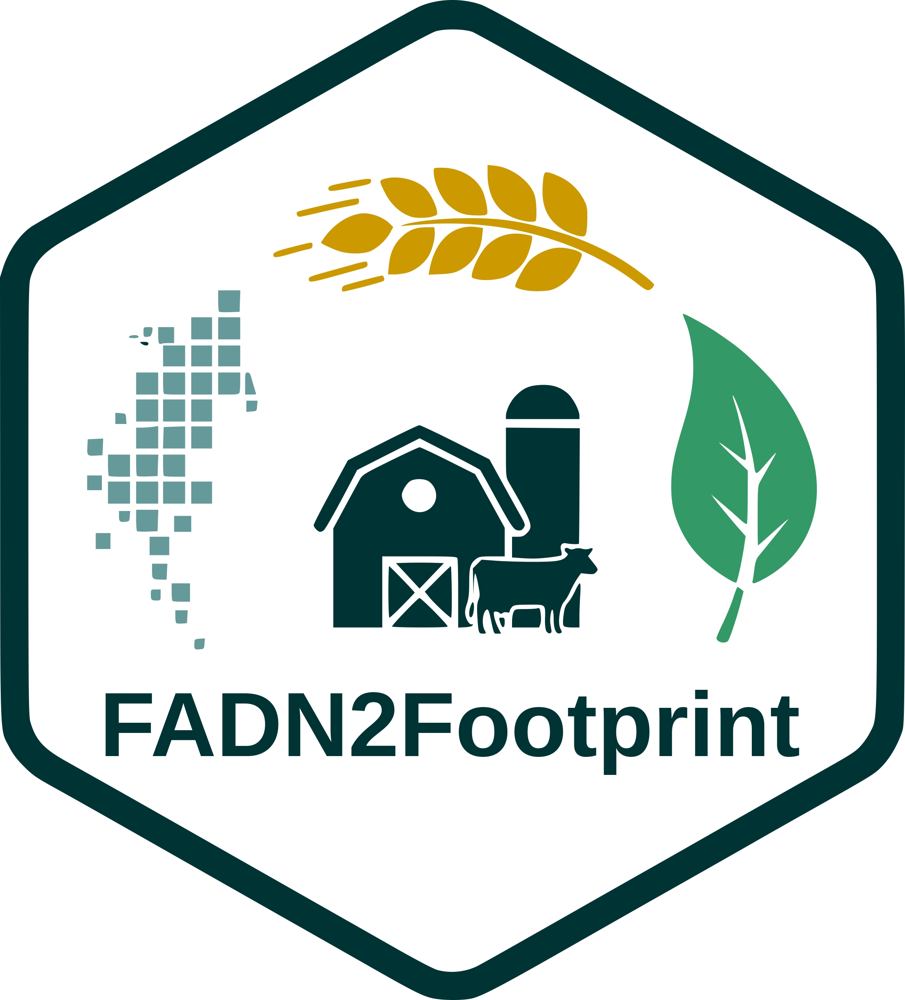

```{r setup, include=FALSE}
knitr::opts_chunk$set(
  collapse = TRUE,
  comment  = "#>",
  eval     = FALSE
)
library(dplyr)
library(tidyr)
library(readxl)
library(gt)

pak::pak("sarah-huet/FADN2Footprint")
library(FADN2Footprint)

options(tibble.width = Inf)

```

Sarah HUET, Kassoum AYOUBA & Valentin BELLASSEN

[sarah.huet\@inrae.fr](mailto:sarah.huet@inrae.fr){.email}
[valentin.bellassen\@inrae.fr](mailto:valentin.bellassen@inrae.fr){.email}

[FADN2Footprint Home Page](http://sarah-huet.github.io/FADN2Footprint/)

If you use FADN2Footprint, please acknowledge and cite FADN2Footprint in
your publications:

**FADN2Footprint: an R package to infer agricultural practices and
compute farms environmental footprints from FADN data**. Huet, Ayouba &
Bellassen (in prep.)

::: {style="text-align: center;"}
{width="200px"}
:::

This package depends on R (\>= 4.1.0).

|                                                                    |
|:-------------------------------------------------------------------|
| /!\\CAUTION /!\\                                                   |
| This package have been tested for cereals and milk productions.    |
| Estimates for other productions are not reliable yet.              |
| Make sure you filter farms in field crops and dairy farming types. |

# Overview

The FADN2Footprint package provides a standardized framework for
transforming raw FADN microdata (EU FADN or national FADN extracts) into
a standardized internal representation that can be used to compute:

- Farm practice indicators (e.g., fertilizer quantity/quality, pesticide
  use, tillage intensity, crop diversity, yields, hedge density, ground
  cover, livestock density, feed intake, manure systems, etc.)

- Environmental footprint: greenhouse gas emissions, biodiversity
  impacts (upcoming: water consumption/pollution)

- Economic performance (price premium, value-added per annual working
  unit, operating margin per non-salaried AWU, return on assets)

- Social performance (employment, generational renewal, farmer
  education)

The package follows a life cycle assessment (LCA) spirit with Scope 3
boundaries.

# The FADN2Footprint S4 class

At the heart of the package is the `FADN2Footprint` S4 class object,
created with the constructor function `data_4FADN2Footprint()`. It
stores your input data, intermediate calculations, and final results in
a structured, traceable manner.

A `FADN2Footprint` object is an S4 container that stores:

- Parsed “internal tables” derived from your raw farm-year dataset
  (still linked by identifiers): farm, crop, herd, input, and output
  tables,

- Optional landscape metrics (hedges, mean field size, ground cover,
  etc.),

- “Empty-by-default” slots for agricultural practice indicators and
  footprint results (to be filled by later modules),

- A traceability log that records key transformations applied during
  construction (e.g., identifier variable names, column removal,
  variable mapping decisions, detected naming scheme).

The constructor returns an S4 instance with (at least) the following
slots:

+---------------------+-----------------------------+---------------------+
| Slot                | Description                 | Status After        |
|                     |                             | Construction        |
+=====================+=============================+=====================+
| `farm`              | Farm characteristics (size, | Parsed from input   |
|                     | location, type)             | data                |
+---------------------+-----------------------------+---------------------+
| `crop`              | Crop data (area,            | Parsed from input   |
|                     | production, yield, sales,   | data                |
|                     | etc.)                       |                     |
+---------------------+-----------------------------+---------------------+
| `herd`              | Livestock herd data (Number | Parsed from input   |
|                     | of head, purchase, sales,   | data                |
|                     | etc.)                       |                     |
+---------------------+-----------------------------+---------------------+
| `input`             | Input use (fertilizers,     | Parsed from input   |
|                     | pesticides, energy, etc.)   | data                |
+---------------------+-----------------------------+---------------------+
| `output`            | Production outputs and      | Parsed from input   |
|                     | yields                      | data                |
+---------------------+-----------------------------+---------------------+
| `landscape_metrics` | User-provided landscape     | As provided (or     |
|                     | data                        | `NULL`)             |
+---------------------+-----------------------------+---------------------+
| `practices`         | Practice indicators         | Inferred            |
+---------------------+-----------------------------+---------------------+
| `footprints`        | Environmental/economic      | Inferred            |
|                     | footprints                  |                     |
+---------------------+-----------------------------+---------------------+
| `traceability`      | Data processing logs        | Populated with      |
|                     |                             | mapping details     |
+---------------------+-----------------------------+---------------------+

In the crop, herd and output tables, the variable FADN_code_letter
encode crops, animals and products using the EU FADN codes.

```{r crop_codes}

data_extra$crops |> 
    dplyr::select(FADN_code_letter, FADN_code_description) |>
    gt()

```

```{r livestock_codes}

data_extra$livestock |> 
    dplyr::select(FADN_code_letter, FADN_code_description) |>
    gt()

```

```{r output_codes}

data_extra$output |> 
    dplyr::select(FADN_code_letter, FADN_code_description) |>
    gt()

```

# Building a FADN2Footprint Object

Constructing a valid `FADN2Footprint` object requires three main steps:

1.  Load your raw data and, the package variable dictionary using
    `data('var_dict')`

2.  Call the constructor function `data_4FADN2Footprint()`

3.  Inspect and validate the resulting object

## What you need to build an object

To build a `FADN2Footprint` object you need:

- A raw European FADN data.frame at farm-year level (wide format). NB:
  If you are using a national FADN, please, refer to the vignette "Data
  Preparation for National FADN and LPIS"

- A set of identifier columns (id_cols) that must include at least:
  "ID", "YEAR", "COUNTRY"

- A variable dictionary (var_dict) that maps your dataset column names
  (EU/national extract) to the package’s internal “common” names
  (var_common)

- Optionally: A landscape_metrics data.frame (e.g., hedge density, mean
  field size, ground cover), which is stored and can be used later to
  compute landscape-related indicators and footprints.

```{r load_data}
# These are illustrative example objects.
# Replace them with your real data.
data("mock_data", package = "FADN2Footprint")
data("dict_FADN", package = "FADN2Footprint")

```

```{r excerpt_mock_data}

head(mock_data$fadn_fict) |> gt()

```

## Build from a FADN dataset already matching the internal dictionary

XX moi je fournirai plutôt le mock data sous format excel, comme tu le
fais pour les tables de conversion en A2. C'est ce que les utilisateurs
auront, donc ça leur permet de s'y retrouver. J'y laisserai notamment la
description des variables, et je limiterais aux variables effectivement
utilisées par le package.

```{r dict_built_in}


my_object <- FADN2Footprint::data_4FADN2Footprint(
  df       = mock_data$fadn_fict,
  var_dict = dict_FADN,
  id_cols  = c("ID", "YEAR", "COUNTRY")
)

```

------------------------------------------------------------------------

# Inferring practices

Before computing footprints we first need to infer practices.

```{r infer_practices}

my_object_w_practices = FADN2Footprint::infer_practices(my_object)

```

# Compute footprints

Once we inferred practices, we can compute environmental footprints.

```{r estimate_GHGE}

my_object_GHGE = FADN2Footprint::compute_footprint_ghg(my_object_w_practices)

```

```{r estimate_biodiv_impact}

data("data_extra", package = "FADN2Footprint")
# These are default parameter values for the BVIAS model.
# These parameters have been calibrated on in situ measurement from the literature.
# See Huet, S., Diallo, A., Regolo, J., Ihasusta, A., Arnaud, L., Bellassen, V., 2026. Biodiversity impact of agricultural products in France: Greater differences across product types than food quality schemes. Ecological Economics 248, 109072. https://doi.org/10.1016/j.ecolecon.2026.109072


my_object_biodiv = FADN2Footprint::compute_footprint_biodiv(
  my_object_w_practices,
  BVIAS_constants = data_extra$BVIAS_var_constant,
  BVIAS_weights = data_extra$BVIAS_var_weight)

```

# Object overview

After running `infer_practices()` and the footprint functions, a
`FADN2Footprint` object contains the following nine S4 slots. The exact
set of populated nested elements depends on the input data and which
footprint functions were run.

+----------------------+----------------------+-------------------------------+
| S4 slot              | What it stores       | Typical structure or contents |
+======================+======================+===============================+
| `@farm`              | Farm-level           | One row per farm-year.        |
|                      | structural and       | Contains identifiers such as  |
|                      | accounting data      | `ID`, `YEAR`, and `COUNTRY`,  |
|                      | parsed from the      | farm characteristics,         |
|                      | original FADN        | production-system variables,  |
|                      | dataset.             | organic status, labour,       |
|                      |                      | economic variables, and       |
|                      |                      | extrapolation weights such as |
|                      |                      | `SYS02`.                      |
+----------------------+----------------------+-------------------------------+
| `@crop`              | Crop- and            | Generally one row per         |
|                      | land-use-level       | farm-year × crop/activity.    |
|                      | internal table       | Contains `FADN_code_letter`,  |
|                      | derived from FADN    | `species`, `land_use_type`,   |
|                      | data.                | `area_ha`, production and     |
|                      |                      | sales quantities, output      |
|                      |                      | values, and crop yields.      |
+----------------------+----------------------+-------------------------------+
| `@herd`              | Livestock structure  | Generally one row per         |
|                      | and observed animal  | farm-year × livestock         |
|                      | numbers.             | category. Contains            |
|                      |                      | `FADN_code_letter`, species,  |
|                      |                      | observed animal numbers such  |
|                      |                      | as `Qobs`, livestock          |
|                      |                      | categories, and related herd  |
|                      |                      | variables.                    |
+----------------------+----------------------+-------------------------------+
| `@input`             | Farm input-use data  | One row per farm-year,        |
|                      | used to infer        | including fertilizer,         |
|                      | practices and        | pesticide, fuel, electricity, |
|                      | calculate impacts.   | feed purchases, and other     |
|                      |                      | supported input quantities or |
|                      |                      | expenditures.                 |
+----------------------+----------------------+-------------------------------+
| `@output`            | Parsed production    | Typically includes tables     |
|                      | outputs, stored as a | for:                          |
|                      | named list.          |                               |
|                      |                      | • `crops`: crop production    |
|                      |                      | and sales                     |
|                      |                      |                               |
|                      |                      | • `milk` or other animal      |
|                      |                      | products: production, sales,  |
|                      |                      | and output value              |
|                      |                      |                               |
|                      |                      | • `meat`: animal sales and    |
|                      |                      | production                    |
|                      |                      |                               |
|                      |                      | • `living_animals`: numbers   |
|                      |                      | and value of live-animal      |
|                      |                      | production                    |
|                      |                      |                               |
|                      |                      | Each table retains the        |
|                      |                      | traceability identifier       |
|                      |                      | columns.                      |
+----------------------+----------------------+-------------------------------+
| `@landscape_metrics` | Optional external    | A data frame or `NULL`. May   |
|                      | landscape data       | contain hedge density, mean   |
|                      | supplied to the      | field size, ground cover, or  |
|                      | constructor.         | other LPIS/Sentinel-derived   |
|                      |                      | metrics. When available,      |
|                      |                      | these are used to infer the   |
|                      |                      | corresponding landscape       |
|                      |                      | practices.                    |
+----------------------+----------------------+-------------------------------+
| `@practices`         | Inferred             | A nested list, principally    |
|                      | agricultural and     | divided into `crops` and      |
|                      | livestock-management | `herding`.                    |
|                      | practices.           |                               |
|                      |                      | **`@practices$crops`** may    |
|                      |                      | contain:                      |
|                      |                      |                               |
|                      |                      | • `crop_diversity`            |
|                      |                      |                               |
|                      |                      | • `N_ferti`, including total, |
|                      |                      | mineral, and organic nitrogen |
|                      |                      | fertilization;                |
|                      |                      |                               |
|                      |                      | • `share_Nmin_ferti`          |
|                      |                      |                               |
|                      |                      | • `pesticides`                |
|                      |                      |                               |
|                      |                      | • `tillage`                   |
|                      |                      |                               |
|                      |                      | • `livestock_density`         |
|                      |                      |                               |
|                      |                      | • `hedge_density`             |
|                      |                      |                               |
|                      |                      | • `mean_field_size`           |
|                      |                      |                               |
|                      |                      | • `ground_cover`              |
|                      |                      |                               |
|                      |                      | **`@practices$herding`** may  |
|                      |                      | contain:                      |
|                      |                      |                               |
|                      |                      | • `general`: milk yield,      |
|                      |                      | livestock density, forage     |
|                      |                      | area, feed autonomy,          |
|                      |                      | concentrate and soybean       |
|                      |                      | shares, etc.                  |
|                      |                      |                               |
|                      |                      | • `feed`: produced and        |
|                      |                      | purchased feed, detailed feed |
|                      |                      | intake, dry matter, gross     |
|                      |                      | energy, and crude protein     |
|                      |                      |                               |
|                      |                      | • `N_excretion`: nitrogen     |
|                      |                      | intake, retention, and        |
|                      |                      | excretion by animal category  |
|                      |                      |                               |
|                      |                      | • `rearing_parameters`:       |
|                      |                      | cattle, swine, and poultry    |
|                      |                      | rearing parameters            |
|                      |                      |                               |
|                      |                      | • `activities`: allocation of |
|                      |                      | animals to milk, meat, and    |
|                      |                      | egg activities                |
|                      |                      |                               |
|                      |                      | • `pseudoherd`: off-farm      |
|                      |                      | animals and products          |
|                      |                      |                               |
|                      |                      | Practice tables generally     |
|                      |                      | include the farm identifiers  |
|                      |                      | and, for crop practices, a    |
|                      |                      | `valid_practice` flag. Farms  |
|                      |                      | failing validation can be     |
|                      |                      | removed from all slots.       |
+----------------------+----------------------+-------------------------------+
| `@footprints`        | Computed             | A nested list, most           |
|                      | environmental        | importantly:                  |
|                      | footprint results    |                               |
|                      | and model            | **`@footprints$GHGE`** —      |
|                      | parameters.          | greenhouse-gas emissions,     |
|                      |                      | including:                    |
|                      |                      |                               |
|                      |                      | • `GHGE_crops`: crop/activity |
|                      |                      | emissions, with component     |
|                      |                      | totals and intensities per    |
|                      |                      | hectare and tonne             |
|                      |                      |                               |
|                      |                      | • `GHGE_feed`: emissions from |
|                      |                      | produced and purchased feed   |
|                      |                      |                               |
|                      |                      | • `GHGE_herd`: enteric        |
|                      |                      | methane, manure-management    |
|                      |                      | methane and nitrous oxide,    |
|                      |                      | plus feed emissions           |
|                      |                      |                               |
|                      |                      | • `GHGE_milk`, `GHGE_meat`,   |
|                      |                      | `GHGE_eggs`: emissions        |
|                      |                      | allocated to animal products  |
|                      |                      |                               |
|                      |                      | • `GHGE_farm`: aggregated     |
|                      |                      | farm-level emissions          |
|                      |                      |                               |
|                      |                      | • `GHGE_pseudoherd`:          |
|                      |                      | aggregated farm-level         |
|                      |                      | emissions accounting for      |
|                      |                      | off-farm animals              |
|                      |                      |                               |
|                      |                      | **`@footprints$BVIAS`** —     |
|                      |                      | biodiversity impact           |
|                      |                      | assessment results,           |
|                      |                      | including:                    |
|                      |                      |                               |
|                      |                      | •                             |
|                      |                      | `model_parameters$constants`  |
|                      |                      |                               |
|                      |                      | • `model_parameters$weights`  |
|                      |                      |                               |
|                      |                      | • `BVI_crops`                 |
|                      |                      |                               |
|                      |                      | • `BVI_feed`                  |
|                      |                      |                               |
|                      |                      | • `BVI_milk`                  |
|                      |                      |                               |
|                      |                      | Other footprint categories    |
|                      |                      | may be added by future or     |
|                      |                      | additional modules. Empty or  |
|                      |                      | uncomputed elements remain    |
|                      |                      | `NULL`.                       |
+----------------------+----------------------+-------------------------------+
| `@traceability`      | Metadata documenting | A list containing the         |
|                      | how the object was   | identifier columns            |
|                      | built and processed. | (`id_cols`), input/version    |
|                      |                      | and variable-mapping          |
|                      |                      | information, removed          |
|                      |                      | zero-only columns,            |
|                      |                      | harmonization decisions,      |
|                      |                      | and—after practice            |
|                      |                      | validation—`discarded_farms`, |
|                      |                      | including the reason each     |
|                      |                      | farm was removed.             |
+----------------------+----------------------+-------------------------------+
