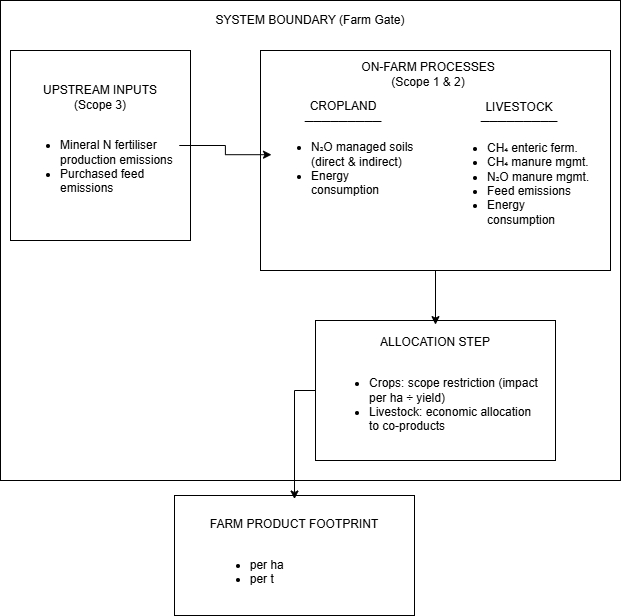

```{r setup, include=FALSE}
knitr::opts_chunk$set(
  collapse = TRUE,
  comment  = "#>",
  eval     = FALSE
)
library(FADN2Footprint)
library(dplyr)
library(tidyr)
library(readxl)
library(gt)
```

# General LCA-spirit approach & system boundaries diagram

The FADN2Footprint package estimates the environmental footprint of European farms using a
life cycle assessment (LCA) spirit approach. The system boundary is defined at the **farm
gate**: all inputs entering the farm and all emissions occurring on-farm or directly
upstream of the farm (scope 1 to scope 3) are accounted for, while downstream processing,
transport, and consumption are excluded.

## Scope definition

The package covers two main scopes of emissions and impacts:

-   **Scope 1 and 2 – On-farm direct emissions** (named farm): greenhouse gas (GHG) emissions occurring
    physically on the farm, including enteric fermentation (CH~4~), manure management
    (CH~4~ and N~2~O), managed soils (N~2~O), and on-farm energy combustion (CO~2~ from
    electricity and diesel consumption).
-   **Scope 3 – Upstream supply chain emissions** (named pseudofarm): GHG emissions from the production of
    mineral (synthetic) nitrogen fertilisers, using a supply-chain-wide life cycle
    emission factor (4.572 kg CO~2~-eq kg^-1^ N; Edwards et al., 2019), GHG emissions from
    the production of the purchased feed and animals.



The table maps each source-level GHG emission variable to the aggregate output 
indicators computed by the package. Rows represent individual emission variables, 
organized into four groups: **crop emissions** (N₂O and CO₂ from fertilizer 
production, diesel, and electricity), **herd feed emissions from on-farm crops**, 
**herd feed emissions from pseudofarm**, and **direct livestock 
emissions** (enteric CH₄, manure CH₄, and manure N₂O). Columns represent aggregate 
indicators grouped into crop totals, herd feed totals, herd-level GHG aggregates, 
and farm-level totals disaggregated by greenhouse gas (CO₂, N₂O, CH₄). A 
**✓** indicates that the source variable is directly summed into the aggregate; 
**✓₋f** signals inclusion of the pseudofarm share *net of* the on-farm portion, 
preventing double-counting when both farm-grown and purchased feeds contribute to 
the same herd total; **acc.** denotes variables already consolidated within the 
crop module and therefore not re-added at the farm level. Empty cells indicate 
no contribution to that aggregate.


```{r tbl-farm-level-calculation}

library(gt)
library(dplyr)

# Build the data frame
df <- data.frame(
  variable = c(
    # Crop emissions
    "crop_N2O_d_kgCO2e",
    "crop_N2O_ATD_kgCO2e",
    "crop_N2O_L_kgCO2e",
    "crop_ghg_ferti_prod_kgCO2e",
    "crop_ghg_diesel_crop_kgCO2e",
    "crop_ghg_heat_fuel_crop_kgCO2e",
    "crop_ghg_elec_crop_kgCO2e",
    # Herd feed farm
    "herd_feed_farm_N2O_d_kgCO2e",
    "herd_feed_farm_N2O_ATD_kgCO2e",
    "herd_feed_farm_N2O_L_kgCO2e",
    "herd_feed_farm_ghg_ferti_prod_kgCO2e",
    "herd_feed_farm_ghg_diesel_crop_kgCO2e",
    "herd_feed_farm_ghg_heat_fuel_crop_kgCO2e",
    "herd_feed_farm_ghg_elec_crop_kgCO2e",
    # Herd feed pseudofarm
    "herd_feed_pseudofarm_N2O_d_kgCO2e",
    "herd_feed_pseudofarm_N2O_ATD_kgCO2e",
    "herd_feed_pseudofarm_N2O_L_kgCO2e",
    "herd_feed_pseudofarm_ghg_ferti_prod_kgCO2e",
    "herd_feed_pseudofarm_ghg_diesel_crop_kgCO2e",
    "herd_feed_pseudofarm_ghg_heat_fuel_crop_kgCO2e",
    "herd_feed_pseudofarm_ghg_elec_crop_kgCO2e",
    # Herd direct emissions
    "herd_CH4_enteric_kgCO2e",
    "herd_CH4_MM_kgCO2e",
    "herd_N2O_D_MM_kgCO2e",
    "herd_N2O_G_mm_kgCO2e",
    "herd_N2O_L_mm_kgCO2e",
    "herd_ghg_heat_fuel_kgCO2e",
    "herd_ghg_elec_kgCO2e"

  ),
  group = c(
    rep("Crop emissions", 7),
    rep("Herd feed – farm", 7),
    rep("Herd feed – pseudofarm", 7),
    rep("Herd direct emissions", 7)
  ),
  crop_total  = c("x","x","x","x","x","x","x",
                  "","","","","","","",
                  "","","","","","","",
                  "","","","","","",""),
  
  herd_feed_farm_total = c("","","","","","","",
                           "x","x","x","x","x","x","x",
                           "","","","","","","",
                           "","","","","","",""),
  herd_feed_pseudofarm_total = c("","","","","","","",
                             "","","","","","","",
                             "x","x","x","x","x","x","x",
                             "","","","","","",""),
  
  herd_farm_ghge_herd = c("","","","","","","",
                          "x","x","x","x","x","x","x",
                          "","","","","","","",
                          "x","x","x","x","x","",""),
  herd_pseudofarm_ghge_herd = c("","","","","","","",
                            "","","","","","","",
                            "x","x","x","x","x","x","x",
                            "x","x","x","x","x","",""),
  
  herd_purchased_feed = c("","","","","","","",
                          "","","","","","","",
                          "x(-farm)","x(-farm)","x(-farm)","x(-farm)","x(-farm)","x(-farm)","x(-farm)",
                          "","","","","","",""),
  
  farm_total_ghge = c("x","x","x","","x","x","x",
                      "acc.","acc.","acc.","","acc.","acc.","acc.",
                      "","","","","","","",
                      "x","x","x","x","x","x","x"),
  pseudofarm_total_ghge = c("x","x","x","x","x","x","x",
                        "acc.","acc.","acc.","acc.","acc.","acc.","acc.",
                        "x(-farm)","x(-farm)","x(-farm)","x(-farm)","x(-farm)","x(-farm)","x(-farm)",
                        "x","x","x","x","x","x","x"),
  
  farm_total_CO2 = c("","","","","x","x","x",
                     "","","","","acc.","acc.","acc.",
                     "","","","","","","",
                     "","","","","","x","x"),
  pseudofarm_total_CO2 = c("","","","x","x","x","x",
                       "","","","acc.","acc.","acc.","acc.",
                       "","","","x(-farm)","x(-farm)","x(-farm)","x(-farm)",
                       "","","","","","x","x"),
  
  farm_total_N2O = c("x","x","x","","","","",
                     "acc.","acc.","acc.","","","","",
                     "","","","","","","",
                     "","","x","x","x","",""),
  pseudofarm_total_N2O = c("x","x","x","","","","",
                       "acc.","acc.","acc.","","","","",
                       "x(-farm)","x(-farm)","x(-farm)","","","","", 
                       "","","x","x","x","",""),
  
  farm_total_CH4 = c("","","","","","","",
                     "","","","","","","",
                     "","","","","","","",
                     "x","x","","","","",""),
  pseudofarm_total_CH4 = c("","","","","","","",
                       "","","","","","","",
                       "","","","","","","",
                       "x","x","","","","",""),
  stringsAsFactors = FALSE
)

# Color palette
col_crop    <- "#1a6b3c"
col_feed    <- "#1a4f6b"
col_pseudo  <- "#4f1a6b"
col_herd    <- "#6b3a1a"
col_farm    <- "#1a3a6b"
col_header  <- "#1B4F72"

make_cell <- function(val, grp) {
  if (val == "") return(gt::html("<span style='color:#cccccc;'>·</span>"))
  if (grepl("acc\\.", val)) return(gt::html("<span style='color:#888;font-style:italic;font-size:10px;'>acc.</span>"))
  if (grepl("-farm", val)) return(gt::html("<span style='color:#6b3a1a;font-weight:bold;font-size:11px;'>✓<sub style='font-size:8px;'>−f</sub></span>"))
  return(gt::html("<span style='color:#1a6b3c;font-weight:bold;font-size:14px;'>✓</span>"))
}

# Apply cell formatting
cols_to_fmt <- c("crop_total","herd_feed_farm_total","herd_feed_pseudofarm_total",
                 "herd_farm_ghge_herd","herd_pseudofarm_ghge_herd","herd_purchased_feed",
                 "farm_total_ghge","pseudofarm_total_ghge","farm_total_CO2","pseudofarm_total_CO2",
                 "farm_total_N2O","pseudofarm_total_N2O","farm_total_CH4","pseudofarm_total_CH4")

for (col in cols_to_fmt) {
  df[[col]] <- mapply(make_cell, df[[col]], df$group, SIMPLIFY = FALSE)
}

df |>
  select(-group) |>
  gt(rowname_col = "variable") |>
  # ---- Column labels with spanners ----
  tab_spanner(
    label = md("**Crop**"),
    columns = crop_total
  ) |>
  tab_spanner(
    label = md("**Herd feed**"),
    columns = c(herd_feed_farm_total, herd_feed_pseudofarm_total)
  ) |>
  tab_spanner(
    label = md("**Herd livestock**"),
    columns = c(herd_farm_ghge_herd, herd_pseudofarm_ghge_herd, herd_purchased_feed)
  ) |>
  tab_spanner(
    label = md("**Farm totals**"),
    columns = c(farm_total_ghge, pseudofarm_total_ghge, farm_total_CO2, pseudofarm_total_CO2,
                farm_total_N2O, pseudofarm_total_N2O, farm_total_CH4, pseudofarm_total_CH4)
  ) |>
  cols_label(
    crop_total            = md("**crop_total**<br><span style='font-size:9px;'>ghg_crop</span>"),
    herd_feed_farm_total  = md("**feed_farm**<br><span style='font-size:9px;'>total_ghg</span>"),
    herd_feed_pseudofarm_total= md("**feed_pseudofarm**<br><span style='font-size:9px;'>total_ghg</span>"),
    herd_farm_ghge_herd   = md("**farm**<br><span style='font-size:9px;'>ghge_herd</span>"),
    herd_pseudofarm_ghge_herd = md("**pseudofarm**<br><span style='font-size:9px;'>ghge_herd</span>"),
    herd_purchased_feed   = md("**purchased**<br><span style='font-size:9px;'>feed_ghge</span>"),
    farm_total_ghge       = md("**farm**<br><span style='font-size:9px;'>total_ghge</span>"),
    pseudofarm_total_ghge     = md("**pseudofarm**<br><span style='font-size:9px;'>total_ghge</span>"),
    farm_total_CO2        = md("**farm**<br><span style='font-size:9px;'>total_CO2</span>"),
    pseudofarm_total_CO2      = md("**pseudofarm**<br><span style='font-size:9px;'>total_CO2</span>"),
    farm_total_N2O        = md("**farm**<br><span style='font-size:9px;'>total_N2O</span>"),
    pseudofarm_total_N2O      = md("**pseudofarm**<br><span style='font-size:9px;'>total_N2O</span>"),
    farm_total_CH4        = md("**farm**<br><span style='font-size:9px;'>total_CH4</span>"),
    pseudofarm_total_CH4      = md("**pseudofarm**<br><span style='font-size:9px;'>total_CH4</span>")
  ) |>
  # ---- Row groups ----
  tab_row_group(label = md("🌾 **Crop emissions**"),         rows =  1:7)  |>
  tab_row_group(label = md("🏠 **Herd feed – farm**"),       rows =  8:14) |>
  tab_row_group(label = md("🔄 **Herd feed – pseudofarm**"), rows = 15:21) |>
  tab_row_group(label = md("🐄 **Herd livestock emissions**"),  rows = 22:26) |>
  row_group_order(groups = c(
    "🌾 **Crop emissions**",
    "🏠 **Herd feed – farm**",
    "🔄 **Herd feed – pseudofarm**",
    "🐄 **Herd livestock emissions**"
  )) |>
  # ---- Stub styling ----
  tab_style(
    style     = cell_text(font  = "monospace", size = px(11), color = "#2C3E50"),
    locations = cells_stub(rows = everything())
  ) |>
  # ---- Row group styling ----
  tab_style(
    style = list(
      cell_fill(color = "#1B4F72"),
      cell_text(color = "white", weight = "bold", size = px(12))
    ),
    locations = cells_row_groups()
  ) |>
  # ---- Column label styling ----
  tab_style(
    style = list(
      cell_fill(color = "#2E86C1"),
      cell_text(color = "white", align = "center", size = px(11))
    ),
    locations = cells_column_labels(columns = everything())
  ) |>
  # ---- Spanner styling ----
  tab_style(
    style = list(
      cell_fill(color = "#1B4F72"),
      cell_text(color = "white", weight = "bold", size = px(12))
    ),
    locations = cells_column_spanners()
  ) |>
  # ---- Alternating row shading ----
  tab_style(
    style     = cell_fill(color = "#F0F7FF"),
    locations = cells_body(rows = seq(1, 25, 2))
  ) |>
  # ---- Cell alignment ----
  cols_align(align = "center", columns = everything()) |>
  cols_align(align = "left",   columns = everything()) |>
  cols_align(align = "center", columns = all_of(cols_to_fmt)) |>
  # ---- Column widths ----
  cols_width(
    variable ~ px(280),
    everything() ~ px(62)
  ) |>
  # ---- Legend ----
  tab_source_note(source_note = md(
    "**Legend:** &nbsp;
     <span style='color:#1a6b3c;font-weight:bold;'>✓</span> Included &nbsp;|&nbsp;
     <span style='color:#6b3a1a;font-weight:bold;'>✓<sub>−f</sub></span> Included minus on-farm feed share &nbsp;|&nbsp;
     <span style='color:#888;font-style:italic;'>acc.</span> Accounted for in crop module &nbsp;|&nbsp;
     <span style='color:#cccccc;'>·</span> Not applicable"
  )) |>
  tab_header(
    title    = md("**GHG Emission Variables – Aggregation Structure**"),
    subtitle = md("Mapping of source variables to aggregate output indicators")
  ) |>
  tab_options(
    table.font.names                  = "Source Sans Pro, Calibri, sans-serif",
    table.font.size                   = px(12),
    table.border.top.color            = "#1B4F72",
    table.border.top.width            = px(3),
    table.border.bottom.color         = "#1B4F72",
    table.border.bottom.width         = px(2),
    column_labels.border.bottom.color = "#AED6F1",
    column_labels.border.bottom.width = px(2),
    row_group.border.top.width        = px(2),
    row_group.border.top.color        = "#AED6F1",
    data_row.padding                  = px(6),
    stub.border.color                 = "#AED6F1",
    stub.border.width                 = px(1),
    heading.background.color          = "#1B4F72",
    heading.title.font.size           = px(15),
    heading.subtitle.font.size        = px(12),
    source_notes.font.size            = px(10),
    table.width                       = pct(100)
  )


```


Beyond greenhouse gases, the system boundary also encompasses:

-   **Biodiversity impact** (BVIAS model): evaluated from on-farm practices (nitrogen
    fertilisation, pesticide use, crop diversity, field size, hedge density, and
    organic/conventional label) applied to farm cropland and grassland areas.
-   **Water consumption and pollution**: blue/green water footprint and nutrient
    surplus–driven water pollution pathway (not yet developed in the current package version.

## Functional units

Impacts are expressed per unit of **farm area** (ha) and subsequently allocated to **farm
products** using multiple functional units:

-   per hectare (e.g., kg CO~2~-eq ha^-1^, BVI~ha~)
-   per tonne of product (e.g., kg CO~2~-eq t^-1^, BVI~t~)
-   per kcal (e.g., kg CO~2~-eq kcal^-1^, BVI~kcal~)
-   per kg of protein (e.g., kg CO~2~-eq kg protein^-1^, BVI~kg protein~)

## Allocation strategy

Following LCA principles (European Commission, 2010), the package prioritize **scope
restriction** over allocation wherever possible:

-   For **crop products**, footprints are attributed directly to each crop through scope
    restriction (per hectare impact divided by crop yield).
-   For **livestock products**, the scope is restricted to the relevant herd (e.g., dairy
    herd for milk), and **economic allocation** is applied to co-products (e.g., milk and
    cull cow meat from dairy cattle). The total herd impact is the sum of: (i) the
    per-hectare impact of all feed consumed (on-farm grown and purchased), and (ii) direct
    on-farm emissions from manure management and enteric fermentation.

# Greenhouse gas emissions

Greenhouse gas emissions are estimated based on IPCC tiers 2 guidelines [IPCC Task Force
on National Greenhouse Gas Inventories et al., 2019] for the following emission sources
([Method article](articles/method-footprint-models.html#sec-method-ghge)):

-   CH4 from enteric fermentation

-   CH4 from manure management

-   N2O from manure management

-   N2O from managed soils

-   C2O from input production and use

The system boundaries are cradle to farm gate: feed production and farming operations are
included. @tbl-ghg-source describes the emission sources included in our estimator for
crops and animals.

Most of our data is only available at the farm level and we are interested in the impact
at the individual product level. Following LCA principles, we estimate emissions at
product level whenever possible (eg. emissions from crop residues are attributed to the
relevant crop, emissions from heating are attributed to the relevant animals). For sources
of emissions for which an estimate is only possible at a higher level (eg. fertilizers,
tractor fuels), the impacts are allocated to the relevant products in proportion to their
economic value [van der Werf et al., 2009, JRC - IES, 2010].

Our approach is consistent with previous work that adapted the IPCC framework for FADN
data [Coderoni and Esposti, 2015, Dabkien˙e et al., 2020]. That said, to the best of our
knowledge we are the first to apply it to the European FADN, which is less detailed than
the national FADNs, and to several years. Fertilizer use before 2014 and fuel use had to
be approximated from their value. For more details see [Method article](articles/method-footprint-models.html#sec-method-ghge)).

```{r}

# Install the package
#install.packages('FADN2Footprint')

# Load your data (here we use the mock data and dictionary included in the package)
data('mock_data')
data('dict_FADN')

# Build the S4 object
my_object = FADN2Footprint::data_4FADN2Footprint(
  df = mock_data,
  var_dict = dict_FADN,
  id_cols = c("ID","YEAR","COUNTRY")
)

# Infer the practices
my_object_w_practices <- FADN2Footprint::infer_practices(my_object)

# Compute GHGE
my_object_GHGE <- FADN2Footprint::compute_footprint_ghg(my_object_w_practices)

```

## Total Greenhouse Gas Emissions from Crop Production

Total greenhouse gas emissions associated with crop production were estimated at the farm
× crop level by aggregating multiple emission sources, combining both direct field-level
emissions and upstream or shared farm-level emissions allocated to individual crops.

### Emission Sources

The following emission components were summed to obtain the total crop-level GHG
footprint:

$$ghg_{crop} = N_2O_d + N_2O_{ATD} + N_2O_L + ghg_{ferti prod} + ghg_{heating fuel} + ghg_{diesel} + ghg_{elec}$$

where:

-   $N_2O_d$ = direct N~2~O emissions from managed soils (kg CO~2~-eq), covering synthetic
    and organic fertiliser application, crop residues, and grazing livestock dung and
    urine deposition, following IPCC Equations 11.1 [@IPCC2006; @IPCC2019];
-   $N_2O_{ATD}$ = indirect N~2~O emissions from atmospheric deposition of volatilised
    nitrogen (kg CO~2~-eq);
-   $N_2O_L$ = indirect N~2~O emissions from nitrogen leaching and run-off (kg CO~2~-eq);
-   $ghg_{ferti prod}$ = upstream emissions from the manufacturing of synthetic nitrogen
    fertilisers (kg CO~2~-eq);
-   $ghg_{diesel}$ = GHG emissions from off-road diesel combustion allocated to the crop
    (kg CO~2~-eq);
-   $ghg_{heating fuel}$ = GHG emissions from heating fuel combustion allocated to the crop
    (kg CO~2~-eq);
-   $ghg_{elec}$ = GHG emissions from on-farm electricity consumption allocated to the
    crop (kg CO~2~-eq).

### Economic Allocation of Shared Farm Emissions

Fuel and electricity emissions, which are reported at the whole-farm level, were allocated
to individual crops proportionally to each crop's contribution to total farm crop output
value (turnover):

$$econ\_alloc_c = \frac{TO_c}{\sum_c TO_c}$$

where $TO_c$ is the economic output of crop $c$. The allocated diesel and electricity
emissions for each crop were then:

$$ghg_{heating fuel,c} = ghg_{heating fuel,farm} \times econ\_alloc_c$$
$$ghg_{elec,c} = ghg_{elec,farm} \times econ\_alloc_c$$

Off-road diesel use was allocated to crops in two steps. First, diesel consumption for ploughing was estimated at crop level using tillage intensity in L/ha (see `f_tillage()`) multiplied by crop area, with crops not subject to tillage assigned zero tillage diesel. Second, the remaining farm-level diesel consumption, after subtracting tillage diesel, was distributed across crops in proportion to their share of total farm area. Farm-level greenhouse gas emissions associated with diesel use were then allocated to each crop proportionally to the quantity of diesel assigned to it, and total crop-level diesel emissions were calculated as the sum of the tillage-related and residual components.

### Limitations

N~2~O emissions from soil organic matter mineralisation following land use change, as well
as carbon stock changes related to farm landscape features (hedge density, ground cover,
grassland management), are not yet included in the current implementation.

```{r GHGE_results_wheat_ha, fig.cap="Distribution and decomposition of wheat GHGE estimated by FADN2Footprint (2016–2018)."}

#load("C:/Users/srhuet/OneDrive/Research/GitHub/Organic_prod_in_Europe/data_raw/FADN_16_18_GHGE.RData")


# ── 1. Extract wheat GHGE ──────────────────────────────────────────────────────

# select farms that ar in the "Crop" type of farming
tmp_farms <- my_object_GHGE@farm |>
  dplyr::filter(TF8 == 1) |>
  dplyr::select(dplyr::all_of(my_object_GHGE@traceability$id_cols))

tmp_raw_wheat <- my_object_GHGE@footprints$GHGE$GHGE_crops |>
  dplyr::semi_join(tmp_farms, by = my_object_GHGE@traceability$id_cols) |>
  dplyr::filter(FADN_code_letter == "CWHTC") |>
  dplyr::mutate(
    dplyr::across(
      dplyr::matches("kgCO2e"),
      list(q95 = ~ quantile(.x, 0.95, na.rm = T, names = F)),
      .names = "{.col}_{.fn}"
    )
  )

# ── 2. Flag aberrant farms (above 95th percentile for total GHGE) ─────────────
tmp_aberrant_wheat <- tmp_raw_wheat |>
  dplyr::filter(total_ghg_crop_kgCO2e_per_ha > total_ghg_crop_kgCO2e_per_ha_q95 |
                  total_ghg_crop_kgCO2e_per_t > total_ghg_crop_kgCO2e_per_t_q95)

wheat_total  <- tmp_raw_wheat |>
  dplyr::anti_join(tmp_aberrant_wheat, by = my_object_GHGE@traceability$id_cols)

# Summarize wheat results for comparison
wheat_total_summary <- wheat_total |>
  dplyr::summarise(
    mean_kgCO2e_per_ha = mean(total_ghg_crop_kgCO2e_per_ha, na.rm = TRUE),
    sd_kgCO2e_per_ha = sd(total_ghg_crop_kgCO2e_per_ha, na.rm = TRUE),
    mean_kgCO2e_per_t = mean(total_ghg_crop_kgCO2e_per_t, na.rm = TRUE),
    sd_kgCO2e_per_t = sd(total_ghg_crop_kgCO2e_per_t, na.rm = TRUE),
    n_obs = n(),
    .by = COUNTRY
  )

# ── 3. Total GHGE distribution ─────────────────────────────────────────────────
ggplot(wheat_total ) +
  aes(x = total_ghg_crop_kgCO2e_per_ha) +
  geom_histogram(bins = 30L, fill = "#112446") +
  facet_wrap(vars(COUNTRY)) +
  labs(
    title    = "Wheat – Distribution of total GHGE (kg CO2e ha\u207b\u00b9)",
    subtitle = "Farms above the 95th percentile excluded",
    x        = "kg CO2e ha\u207b\u00b9",
    y        = "Number of observation (farm x year)"
  ) +
  theme_minimal(base_size = 12)

ggplot(wheat_total ) +
  aes(x = COUNTRY, y = total_ghg_crop_kgCO2e_per_ha) +
  geom_boxplot(fill = "#2c7bb6", alpha = 0.7) +
  coord_flip() +
  labs(
    title = "Wheat – GHGE by country (kg CO2e ha\u207b\u00b9)",
    x     = NULL,
    y     = "kg CO2e ha\u207b\u00b9"
  ) +
  theme_minimal(base_size = 12)


ggplot(wheat_total ) +
  aes(x = total_ghg_crop_kgCO2e_per_t) +
  geom_histogram(bins = 30L, fill = "#112446") +
  facet_wrap(vars(COUNTRY)) +
  labs(
    title    = "Wheat – Distribution of total GHGE (kg CO2e t\u207b\u00b9)",
    subtitle = "Farms above the 95th percentile excluded",
    x        = "kg CO2e t\u207b\u00b9",
    y        = "Number of observation (farm x year)"
  ) +
  theme_minimal(base_size = 12)

ggplot(wheat_total ) +
  aes(x = COUNTRY, y = total_ghg_crop_kgCO2e_per_t) +
  geom_boxplot(fill = "#2c7bb6", alpha = 0.7) +
  coord_flip() +
  labs(
    title = "Wheat – GHGE by country (kg CO2e t\u207b\u00b9)",
    x     = NULL,
    y     = "kg CO2e t\u207b\u00b9"
  ) +
  theme_minimal(base_size = 12)

# ── 4. GHGE by component ───────────────────────────────────────────────────────
wheat_compo  <- wheat_total  |>
  dplyr::select(dplyr::all_of(my_object_GHGE@traceability$id_cols),
                dplyr::matches("kgCO2e_per_ha$")) |>
  tidyr::pivot_longer(cols = dplyr::matches("kgCO2e_per_ha$"),
                      names_to  = "component",
                      values_to = "kgCO2e_per_ha") |>
  dplyr::filter(component != "total_ghg_crop_kgCO2e_per_ha") 

wheat_compo_summary <- wheat_compo|>
  dplyr::summarise(
    kgCO2e_per_ha_mean = mean(kgCO2e_per_ha, na.rm = TRUE),
    kgCO2e_per_ha_sd   = sd(kgCO2e_per_ha,   na.rm = TRUE),
    .by = c(component, COUNTRY)
  )

ggplot(wheat_compo_summary ) +
  aes(x = COUNTRY, fill = component) +
  # stacked bars
  geom_bar(
    aes(y = kgCO2e_per_ha_mean),
    stat     = "identity",
    width    = 0.7,
    colour   = "white"
  ) +
  coord_flip() +
  scale_fill_brewer(palette = "Set2") +
  labs(
    title = "Wheat \u2013 Mean GHGE by component and country (kg CO2e ha\u207b\u00b9)",
    x     = NULL,
    y     = "kg CO2e ha\u207b\u00b9",
    fill  = "Component"
  ) +
  theme_minimal(base_size = 12) +
  theme(legend.position = "bottom")


wheat_compo  <- wheat_total  |>
  dplyr::select(dplyr::all_of(my_object_GHGE@traceability$id_cols),
                dplyr::matches("kgCO2e_per_t$")) |>
  tidyr::pivot_longer(cols = dplyr::matches("kgCO2e_per_t$"),
                      names_to  = "component",
                      values_to = "kgCO2e_per_t") |>
  dplyr::filter(component != "total_ghg_crop_kgCO2e_per_t") 

wheat_compo_summary <- wheat_compo|>
  dplyr::summarise(
    kgCO2e_per_t_mean = mean(kgCO2e_per_t, na.rm = TRUE),
    kgCO2e_per_t_sd   = sd(kgCO2e_per_t,   na.rm = TRUE),
    .by = c(component, COUNTRY)
  )

ggplot(wheat_compo_summary ) +
  aes(x = COUNTRY, fill = component) +
  # stacked bars
  geom_bar(
    aes(y = kgCO2e_per_t_mean),
    stat     = "identity",
    width    = 0.7,
    colour   = "white"
  ) +
  coord_flip() +
  scale_fill_brewer(palette = "Set2") +
  labs(
    title = "Wheat \u2013 Mean GHGE by component and country (kg CO2e t\u207b\u00b9)",
    x     = NULL,
    y     = "kg CO2e t\u207b\u00b9",
    fill  = "Component"
  ) +
  theme_minimal(base_size = 12) +
  theme(legend.position = "bottom")


# ── 5. Summary table ───────────────────────────────────────────────────────────
wheat_compo_summary  |>
  dplyr::mutate(
    `Mean ± SD (kg CO2e t⁻¹)` = sprintf("%.1f ± %.1f", kgCO2e_per_t_mean, kgCO2e_per_t_sd)
  ) |>
  dplyr::select(COUNTRY, component, `Mean ± SD (kg CO2e t⁻¹)`) |>
  tidyr::pivot_wider(names_from = COUNTRY, values_from = `Mean ± SD (kg CO2e t⁻¹)`) |>
  kable(caption = "Wheat GHGE by component and country (FADN2Footprint estimate)") |>
  kable_styling(bootstrap_options = c("striped", "hover", "condensed"), full_width = FALSE)
```

```{r GHGE_results_wheat_t, fig.cap="Distribution and decomposition of wheat GHGE estimated by FADN2Footprint (2016–2018)."}

# ── 1. Extract wheat GHGE ──────────────────────────────────────────────────────

# select farms that ar in the "Crop" type of farming
tmp_farms <- my_object_GHGE@farm |>
  dplyr::filter(TF8 == 1) |>
  dplyr::select(dplyr::all_of(my_object_GHGE@traceability$id_cols))

tmp_raw_wheat <- my_object_GHGE@footprints$GHGE$GHGE_crops |>
  dplyr::semi_join(tmp_farms, by = my_object_GHGE@traceability$id_cols) |>
  dplyr::filter(FADN_code_letter == "CWHTC") |>
  dplyr::mutate(
    dplyr::across(
      dplyr::matches("kgCO2e"),
      list(q95 = ~ quantile(.x, 0.95, na.rm = T, names = F)),
      .names = "{.col}_{.fn}"
    )
  )

# ── 2. Flag aberrant farms (above 95th percentile for total GHGE) ─────────────
tmp_aberrant_wheat <- tmp_raw_wheat |>
  dplyr::filter(total_ghg_crop_kgCO2e_per_ha > total_ghg_crop_kgCO2e_per_ha_q95 |
                  total_ghg_crop_kgCO2e_per_t > total_ghg_crop_kgCO2e_per_t_q95)

wheat_total  <- tmp_raw_wheat |>
  dplyr::anti_join(tmp_aberrant_wheat, by = my_object_GHGE@traceability$id_cols)

# Summarize wheat results for comparison
wheat_total_summary <- wheat_total |>
  dplyr::summarise(
    mean_kgCO2e_per_ha = mean(total_ghg_crop_kgCO2e_per_ha, na.rm = TRUE),
    sd_kgCO2e_per_ha = sd(total_ghg_crop_kgCO2e_per_ha, na.rm = TRUE),
    mean_kgCO2e_per_t = mean(total_ghg_crop_kgCO2e_per_t, na.rm = TRUE),
    sd_kgCO2e_per_t = sd(total_ghg_crop_kgCO2e_per_t, na.rm = TRUE),
    n_obs = n(),
    .by = COUNTRY
  )

# ── 3. Total GHGE distribution ─────────────────────────────────────────────────
ggplot(wheat_total ) +
  aes(x = total_ghg_crop_kgCO2e_per_t) +
  geom_histogram(bins = 30L, fill = "#112446") +
  facet_wrap(vars(COUNTRY)) +
  labs(
    title    = "Wheat – Distribution of total GHGE (kg CO2e t\u207b\u00b9)",
    subtitle = "Farms above the 95th percentile excluded",
    x        = "kg CO2e t\u207b\u00b9",
    y        = "Number of observation (farm x year)"
  ) +
  theme_minimal(base_size = 12)

ggplot(wheat_total ) +
  aes(x = COUNTRY, y = total_ghg_crop_kgCO2e_per_t) +
  geom_boxplot(fill = "#2c7bb6", alpha = 0.7) +
  coord_flip() +
  labs(
    title = "Wheat – GHGE by country (kg CO2e t\u207b\u00b9)",
    x     = NULL,
    y     = "kg CO2e t\u207b\u00b9"
  ) +
  theme_minimal(base_size = 12)

# ── 4. GHGE by component ───────────────────────────────────────────────────────
wheat_compo  <- wheat_total  |>
  dplyr::select(dplyr::all_of(my_object_GHGE@traceability$id_cols),
                dplyr::matches("kgCO2e_per_t$")) |>
  tidyr::pivot_longer(cols = dplyr::matches("kgCO2e_per_t$"),
                      names_to  = "component",
                      values_to = "kgCO2e_per_t") |>
  dplyr::filter(component != "total_ghg_crop_kgCO2e_per_t") 

wheat_compo_summary <- wheat_compo|>
  dplyr::summarise(
    kgCO2e_per_t_mean = mean(kgCO2e_per_t, na.rm = TRUE),
    kgCO2e_per_t_sd   = sd(kgCO2e_per_t,   na.rm = TRUE),
    .by = c(component, COUNTRY)
  )

ggplot(wheat_compo_summary ) +
  aes(x = COUNTRY, fill = component) +
  # stacked bars
  geom_bar(
    aes(y = kgCO2e_per_t_mean),
    stat     = "identity",
    width    = 0.7,
    colour   = "white"
  ) +
  coord_flip() +
  scale_fill_brewer(palette = "Set2") +
  labs(
    title = "Wheat \u2013 Mean GHGE by component and country (kg CO2e t\u207b\u00b9)",
    x     = NULL,
    y     = "kg CO2e t\u207b\u00b9",
    fill  = "Component"
  ) +
  theme_minimal(base_size = 12) +
  theme(legend.position = "bottom")


# ── 5. Summary table ───────────────────────────────────────────────────────────
wheat_compo_summary  |>
  dplyr::mutate(
    `Mean ± SD (kg CO2e t⁻¹)` = sprintf("%.1f ± %.1f", kgCO2e_per_t_mean, kgCO2e_per_t_sd)
  ) |>
  dplyr::select(COUNTRY, component, `Mean ± SD (kg CO2e t⁻¹)`) |>
  tidyr::pivot_wider(names_from = COUNTRY, values_from = `Mean ± SD (kg CO2e t⁻¹)`) |>
  kable(caption = "Wheat GHGE by component and country (FADN2Footprint estimate)") |>
  kable_styling(bootstrap_options = c("striped", "hover", "condensed"), full_width = FALSE)
```

-   

## Total Greenhouse Gas Emissions from Livestock Products

Total greenhouse gas emissions associated with livestock products were estimated at the
farm × year × livestock category level by aggregating direct herd emissions and
feed-related emissions, then allocating the total impact to individual outputs (milk,
meat, eggs) using economic allocation ratios.

### Step 1 — Emission Sources

#### Direct Herd Emissions

Three emission sources were computed at the livestock category level:

-   **Enteric fermentation CH~4~**: methane emissions from digestive processes;
-   **Manure management CH~4~**: methane emissions from manure storage and treatment;
-   **Manure management N~2~O**: direct N~2~O emissions, N~2~O from volatilisation,
    and indirect N~2~O from leaching.

#### Feed-Related Emissions

Feed-related GHG impacts (kg CO~2~-eq) were estimated from the crop-level footprints of
feed crops, summarised per farm × year × livestock category. Feed emissions were
aggregated as area-weighted means of GHG intensity (kg CO~2~-eq ha^-1^) across feed crops,
then converted to totals by multiplying intensity by feed area.

#### Aggregation

All emission components were summed to obtain the total livestock category-level GHG
footprint:

$$ghg_{livestock} = ghg_{feed} + CH_4^{enteric} + CH_4^{MM} + N_2O_d^{MM} + N_2O_G^{MM} + N_2O_L^{MM}$$

where $MM$ denotes manure management, $d$ direct emissions, $G$ gas from volatilization, and $L$ leaching and run-off.

### Step 2 — Allocation to Products

#### Economic Allocation to Outputs

Livestock activities generate multiple co-products (e.g., milk and meat from cull cows).
To attribute emissions to individual outputs, we use economic allocation ratios based on
the relative economic value of each output:

$$r_{alloc,p} = \frac{TO_p}{\sum_p TO_p}$$

where $TO_p$ is the economic output value of product $p$ for a given livestock category.
When accounting for off-farm animals (pseudo-herd), the economic allocation was extended
to combine on-farm and off-farm herd outputs ([Method article](articles/method-footprint-models.html#sec-method-econ-alloc)).

#### Cow Milk

For farms with a dairy cattle activity and positive milk production, total herd emissions
were allocated to milk using the economic allocation ratio. GHG intensities
were then expressed as:

$$ghg_{per\,ha} = \frac{ghg_{component} \times r_{alloc}}{A_{feed}}$$

$$ghg_{per\,t} = \frac{ghg_{component} \times r_{alloc}}{Q_{milk}}$$

where $A_{feed}$ is the total feed area (ha) and $Q_{milk}$ is the milk production (t
yr^-1^). These intensity indicators were computed for each emission component and for the
total.

### Limitations

Allocation to meat and egg outputs is currently reserved for future implementation. Only
cow milk is fully implemented at this stage.

# Biodiversity impact

## The BVI model

This work is based on the Biodiversity Value Increment (BVI) implemented by Lindner et al.
(2022, 2019; Fig. A1). The BVI is not an empirical measurement of biodiversity (e.g.,
richness, abundance, extinction risk) but rather a unit-less index of the biodiversity
quality, reflecting the naturalness of an ecosystem. The BVI expresses the pressure put by
agricultural practices on biodiversity (i.e., the lowest the BVI, the highest the
biodiversity quality and the more intact the biophysical integrity of the considered
ecosystem). It assesses the incremental impact on biodiversity of agricultural practices
implemented at both the plot level and adjacent semi-natural elements, incorporating land
use type (natural ecosystem, permanent grassland, or arable land), landscape effects, and
farming intensity. BVIAS retains the BVI model’s principle that optimal biodiversity
exists in natural ecosystems, while the actual biodiversity value of a plot depends on the
intensity of the implemented practices, within land-use-specific ranges (i.e., the
biodiversity value range of arable land differs from the grassland one). To obtain a
single biodiversity value, the input practice values cross four steps (Section A.2.1 and
Fig. A1). First, each practice value is normalized between 0 and 1, on the 95th percentile
of the practice values: practice values equaling zero are normalized at 0, while practice
values at the 95th percentile or above are normalized at 1; hence a normalized intensity
of 0.5 corresponds to half the 95th percentile (Table A2 and Table A3). Second, normalized
practice intensities are translated into a biodiversity value through a practice-specific
response function (Fig. A4). Third, practices are aggregated into a unique unit-less
biodiversity value (BVLU) using a weighted average. While Lindner et al. (2022) equally
weights all practices, here weights are based on the relative importance of each practice
in driving biodiversity loss (see next paragraph on calibration). Fourth, BVIAS projects
the biodiversity value within the land-use-specific range to obtain a per hectare
biodiversity value (BVIha). Considering yields, BVIAS also allows the estimation of an
impact at different product functional units (e.g., per ton, per kcal).

The present BVIAS model extends the BVI framework, originally chosen by ADEME for
environmental labeling (Lindner et al., 2022) in two main ways: the input farming
practices and the parameter calibration (Fig. A1). Instead of three (Lindner et al.,
2022), BVIAS evaluates nine key farming practices affecting biodiversity: nitrogen
fertilizer use (quantity and quality), hedge density, livestock density, plant protection
agents, ground cover duration, tillage, field size, and crop diversity (the latter six
applying only to arable land and livestock density applying only to grassland). Instead of
being retrieved from a life cycle inventory (Lindner et al., 2022), each practice
intensity is here derived from FADN and LPIS data (Section 3), hence relying on a large
farm dataset (e.g., \> 7,500 farms for French FADN in 2020).

Furthermore, in BVIAS, we calibrate each model parameter based on in situ data sourced
from the literature, proceeding in two steps (Section A.2.2). First, we define the
boundaries of the land-use specific ranges in our modeling framework by retrieving plant
species richness of nine land use archetypes (Gallego-Zamorano et al., 2022; Section
A.2.2.1 and Table A5). Secondly, we calibrate the practice specific response functions
constants and aggregation weights, using the optim function of base R (R Core Team, 2023)
to reduce the distance from one of the ratio between our results and the results retrieved
from the literature, reflecting the abundance or richness of many taxa from several life
kingdoms (Beketov et al., 2013; Sánchez-Bayo and Wyckhuys, 2019; Sirami et al., 2019; Tuck
et al., 2014; Vallé et al., 2023; Section A.2.2.2 and A.2.2.3; Table A6).

## Allocation of biodiversity impact to farm products

To estimate the biodiversity impact of farm products, we follow life cycle analysis (LCA)
principles, prioritizing scope restriction where possible and allocation where necessary
(European Commission, 2010). For all farm products, the biodiversity impact is expressed
in the same BVI unit-less index, for different functional units: per hectare (BVIha), per
ton (BVIt), per kcal (BVIkcal), or per kg of protein (BVIkg protein). For crops, we
estimate practice intensities at the crop level for within field practices (fertilization,
pesticides use, tillage) and at the farm-level for landscape variables (hedge density,
crop diversity, ground cover, mean field size). To attribute within field practices to
specific crops within the farm, we use the crop practices survey (Ministère De
L’Agriculture - SSP, 2019) as an allocation key. Then, practices intensities are
normalized and aggregated at the crop level (i.e., scope restriction) to obtain a BVI per
hectare (BVIha) for each crop. The biodiversity impact per ton of crop (BVIt) is then
calculated as: BVIt=BVIha/Y where Y is the yield of the considered crop in t/ha. For
animal products, we restrict the scope to the herd involved in the product of interest
(e.g., dairy herd for milk production; Section A.2.5 and Fig. A3) but apply economic
allocation for co-products from this herd (e.g., milk and cull cow meat from dairy
cattle). We assessed the animal product impact in two steps. First, we estimate the total
impact of the herd activity (e.g., milk production) as the sum of the biodiversity impact
BVIha of the feed given to the livestock activity (e.g., feed, including both farm-grown
and externally sourced purchased feed, given to the dairy cows, heifers and calves
involved in the milk production). The BVIha of both the on-farm and off-farm feed is
estimated from the agricultural practices implemented to produce it (Section 3.4 ).
Second, we allocate the activity total impact among co-products in proportion to their
economic value, aligning with standard LCA practices and reflecting their contribution to
environmental impact (Koch and Salou, 2020). Then, we divide the per hectare impact
allocated to a co-product by the produced quantity of this co-product.

# Water footprint

WORK IN PROGRESS
