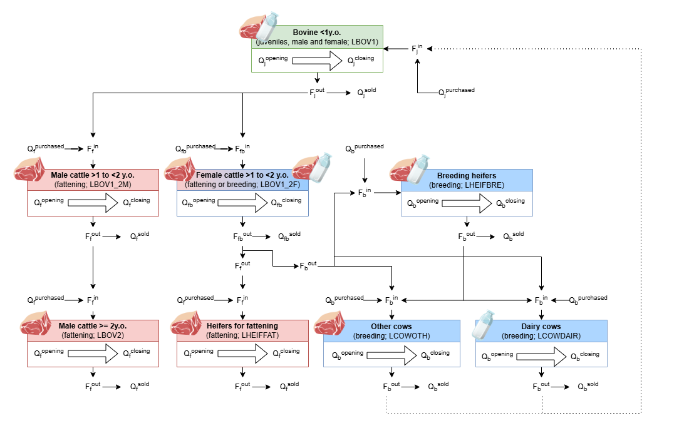
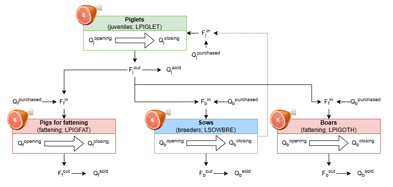
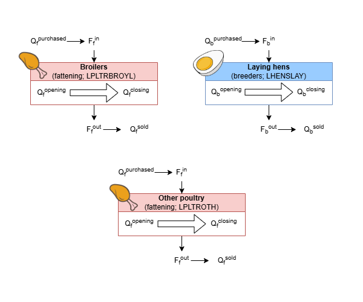

# Why agricultural practice inference is needed {#sec-method-practices-intro}

Our final objective is to estimate the environmental footprint of
agricultural products. This requires first to characterize farming
practices effectively implemented at the farm level, and that are not
directly registered in Farm Accountancy Data Network (FADN).
Specifically, we infer nine agricultural practices from FADN variables
and six more when adding Land Parcel Identification System (LPIS)
associated with Small Woody Feature (SWF) and Ground cover from
SENTINEL-2 data, and parameters from national greenhouse gas inventories
from UNFCCC (@tbl-practice-list).


::: {#tbl-practice-list}

+----------------+--------------------------+------------------+
| Data source /  | FADN (+ Farm practices   | \+ LPIS & SWF &  |
| Practices      | survey & feed tables for | SENTINEL-2 +     |
|                | allocation keys)         | parameters from  |
|                |                          | national GHGIs   |
+================+==========================+==================+
| Crop practices | Fertilizer quantity,     | Hedge density    |
|                | organic and mineral      |                  |
|                |                          | Mean Field Size  |
|                | Pesticides               |                  |
|                |                          | Ground Cover     |
|                | Tillage                  |                  |
|                |                          |                  |
|                | Crop Diversity           |                  |
|                |                          |                  |
|                | Yields                   |                  |
+----------------+--------------------------+------------------+
| Grassland      | Fertilizer quantity,     | Hedge density    |
| practices      | organic and mineral      |                  |
|                |                          | Yields           |
|                | Livestock density        |                  |
+----------------+--------------------------+------------------+
| Herding        | Feed intake              | Manure           |
| practices      |                          | Management       |
|                | Rearing parameters       | System           |
|                |                          |                  |
|                | Production yields        | Animal Weight    |
+----------------+--------------------------+------------------+

List of agricultural practices inferred by the FADN2Footprint package,
based on FADN data, potentially combined with data from LPIS, SWF,
SENTINEL-2, and national GHGIs.
:::

To infer these practices, we used several FADN primary variables

::: {#tbl-practice-FADN-variable}
+------------------------------+--------------------------------------+
| Agricultural practices       | FADN variable                        |
+==============================+======================================+
| Fertilizer quantity          | Crop areas                           |
| (mineral)                    |                                      |
|                              | Amount of mineral nitrogen           |
|                              | fertilizer                           |
+------------------------------+--------------------------------------+
| Fertilizer quantity          | Crop areas, production and\          |
| (organic)                    | sales                                |
|                              |                                      |
|                              | Animal number and category           |
|                              |                                      |
|                              | Feed purchases                       |
+------------------------------+--------------------------------------+
| Pesticides                   | Crop areas                           |
|                              |                                      |
|                              | Pesticides purchases                 |
+------------------------------+--------------------------------------+
| Tillage                      | Crop areas                           |
|                              |                                      |
|                              | Off-road diesel purchases            |
+------------------------------+--------------------------------------+
| Crop diversity               | Crop areas                           |
+------------------------------+--------------------------------------+
| Crop Yields                  | Crop areas and production            |
+------------------------------+--------------------------------------+
| Livestock density            | Grassland areas                      |
|                              |                                      |
|                              | Animal number and category           |
+------------------------------+--------------------------------------+
| Feed intake                  | Crop production and\                 |
|                              | sales                                |
|                              |                                      |
|                              | Animal number and category           |
|                              |                                      |
|                              | Feed purchases                       |
+------------------------------+--------------------------------------+
| Rearing parameters           | Animal number and category           |
+------------------------------+--------------------------------------+
| Production Yields            | Animal number and category           |
|                              |                                      |
|                              | Animal product production            |
+------------------------------+--------------------------------------+

FADN variables used to infer agricultural practices
:::

# Crop practices {#sec-method-practices-crops}

## Tillage {#sec-method-practices-tillage}

Tillage intensity (expressed in L of diesel used for tillage/ha) is
estimated from the farm’s off-road diesel consumption, which is
allocated to the different crops according to their area. Then, we
subtract the average amount of off-road diesel per hectare used by farms
which practice direct seeding, i.e., cultivate crops without tillage
(Chenu and Butault, 2015). The implicit assumption is that the average
off-road diesel use in these farms broadly corresponds to the amount of
diesel used for other interventions than tillage. Note that tillage
generally represents *43*% of off-road diesel consumption due to
mechanization in cereal fields (Chenu and Butault, 2015), so even the
total consumption is already highly correlated with tillage intensity.

## Nitrogen fertilization {#sec-method-practices-Nferti}

The intensity of nitrogen fertilization is estimated for both mineral
and organic fertilizers. For mineral fertilizers, the amount of mineral
nitrogen brought to the farm, directly reported in the FADN, is
allocated to the different crops using national mineral nitrogen input
averages as a distribution key (Ministère De L’Agriculture - SSP, 2019)
(see “PKGC_N_ferti” sheet of Appendix C).

For organic fertilizers, as the FADN variable is not well-informed, we
estimate these inputs in two different ways, depending on whether or not
the farm has livestock.

For farms without livestock, a standard value, equal to the national
average of organic nitrogen input per crop for farms that do not produce
organic manure (Ministère De L’Agriculture - SSP, 2019; see
“PKGC_N_ferti” sheet of Appendix C), is added to the different crops,
distinguishing between organic and conventional farms.

For farms with livestock, we consider that the total amount of nitrogen
excreted by the farm herd is spread on-farm. The amount of nitrogen
excreted by livestock is calculated at the farm scale, and then
allocated among the different crops. The calculation of nitrogen
excretion by animals is based on the livestock population reported in
FADN and the estimation of the feed quantity and nutritional quality of
the ration provided to these animals (see Section 2.7.1), in accordance
with IPCC recommendations (Calvo Buendia et al., 2019; Eggleston et al.,
2006). The crop allocation uses the national averages of organic
nitrogen input per crop of farms producing their own manure as a
distribution key (Ministère De L’Agriculture - SSP, 2019); see
“PKGC_N_ferti_org” sheet in Appendix C).

If the resulting amount is smaller than the lowest value between i) the
national average of organic nitrogen inputs and ii) the lower bound of
the 95% confidence interval of the average of organic nitrogen inputs of
farms producing their own organic manure (Ministère De L’Agriculture -
SSP, 2019), we assign the lowest of these two values instead (implicitly
concluding that despite having a few animals, these farms import
manure).

At the opposite, if the resulting amount is greater than the highest
value between i) the national average of organic nitrogen inputs and ii)
the higher bound of the *95*% confidence interval of the average of
organic nitrogen inputs of farms producing their own organic manure
(Ministère De L’Agriculture - SSP, 2019), we assign the highest of these
two values instead (implicitly concluding that these farms have too many
animals per hectare and therefore export manure).

In addition, the proportion of mineral nitrogen on total nitrogen input
to crops is used as a fully-fledged parameter of the model (Lindner et
al., 2019).

## Pesticide use {#sec-method-pesticides}

The intensity of the application of pesticides is estimated using the
purchased value (€) in pesticides recorded in the FADN. This value is
allocated to the different crops using the national average Treatment
Frequency Index (TFI) as a distribution key (Ministère De
L’Agriculture - SSP, 2019) (see “IFT_ref” sheet of Appendix C). We
accounted for the lower toxicity of products used in organic farming by
correcting the value in pesticides of organic farms by the ratio between
the average toxicity of products used in organic farming and the average
toxicity of products used in conventional agriculture.

To assess the average toxicities of products used either in organic or
conventional farming, we estimate the toxicity by dose of four among the
top ten best-selling products in each of these production modes (BNV-D,
2020). We select these four products for the availability of data to
determine their toxicity, by multiplying their “freshwater ecotoxicity”
characterization factor (Andreasi Bassi et al., 2023) by their unit dose
(Ministère de l’agriculture, de l’agroalimentaire et de la forêt, 2017).
In line with the ADEME proposal for environmental labeling (ADEME,
2024), the characterization factor is doubled for organic molecules
compared to inorganic molecules (e.g., copper). Then, we calculate the
average toxicity of products used in organic or conventional agriculture
as the weighted average of the toxicity of the four products by the
corresponding number of unit doses (NODU) used in France in 2020 (see
“A.5.1_substance_top10” sheet of Appendix C). As a result, we estimate
that each euro spent on plant protection in organic farms is 3.82 times
less toxic than a plant protection euro in conventional farms.

# Landscape variables {#sec-method-practices-landscape-var}

To take into account the landscape dimension of agricultural practices,
we estimate four parameters: hedge density, mean field size, crop
diversity and ground cover. To calculate the variables necessary for
estimating these parameters, we first extract from the 2020 French LPIS
(IGN, 2020) all plots from farms registered our 2020 FADN-AC-FQS
database.

To extract these plots, we use the PACAGE plot numbers (identification
number of the plot in the Common Agricultural Policy registration) as
primary join key. We face three situations:

-   The farm has the same PACAGE number in FADN and AC: then the LPIS
    plots with this PACAGE number are associated with that FADN-AC-FQS
    farm;

-   The PACAGE numbers differ between FADN and AC and only one of them
    corresponds to a LPIS PACAGE number: the LPIS plots of this PACAGE
    number are associated with that FADN-AC-FQS farm

-   No PACAGE number is registered in either the FADN or the AC, or the
    PACAGE numbers differ between FADN and AC, and none of them
    corresponds to a LPIS PACAGE number: no plot is associated with a
    FADN-AC-FQS holding. Such cases are found for 443 and 318
    metropolitan farms, respectively. These holdings are mainly
    concentrated in the OTEX viticulture, market gardening and pig
    and/or poultry farming.

This extraction results in a subsample of the LPIS that we intersect
with the Hedges layer of the BD TOPO® database (IGN and ASP, 2020) to
determine the variables required to estimate the three parameters.

## Hedge density {#sec-method-practices-hedge}

Hedge density is the ratio of the sum in linear meters of hedge to the
area of the holding (UAA). For the calculation of linear lengths, we use
the same procedure as previously used in a similar work at the scale of
the regions of France (Bamière et al., 2023).

Firstly, we need to expand the LPIS blocks. Hedges are not always
inside, outside or at the edge of LPIS blocks (all three cases present).
However, they rarely cut a block in half. The first step is to expand
the LPIS blocks by a buffer zone of 10m. The length of 10 m for the
buffer zone is determined visually. It seems that beyond 10 m, it is
common to make mistakes when combining a hedge with two islets which are
actually separated by a road. Conversely, below 10 m, it seems common to
count as “no cultivation” hedges that are clearly on the edge of a
field.

Secondly, we intersected the hedge lines with the expanded blocks to
determine a border length. There are four cases for each piece of hedge
from the intersection: 1. The piece of hedge does not intersect any
enlarged block. The piece of hedge is considered to be lined with
non-agricultural uses on both sides and twice its length is assigned to
“No culture”. 2. The piece of hedge intersects a single expanded block.
The piece of hedge is considered to be bordered by agricultural use on
one side, and non-agricultural use on the other. Its length is assigned
once to the crop/grassland type of the block and another time to “No
crop”. 3. The hedge piece intersects two blocks. The hedge piece is
considered to be bordered on both sides by agricultural use. Its length
is assigned once to the type of crop/grassland of each block. 4. The
piece of hedge intersects more than two blocks. Its length is then
affected more than twice. This case results in an aberration (hedge with
more than three sides). To avoid this, the corresponding lengths are
multiplied by the ratio of the initial length and the sum of the
affected lengths so that the sum of the corrected lengths is exactly
equal to the initial hedge piece length.

Then, to calculate the hedge density for each farm, we distinguish four
plot categories for each variable (hedge length and UAA):

-   Total

-   Permanent grassland (including grasslands, moors and alpine
    pastures)

-   Arboriculture (including vines)

-   Other crops

## Mean field size {#sec-method-practices-mean-field-size}

The mean field size is the ratio of the UAA to the number of plots. We
distinguish four plot categories for each variable (UAA and number of
plots):

-   Total

-   Permanent grassland (including grasslands, moors and alpine
    pastures)

-   Arboriculture (including vines)

-   Other crops

## Crop diversity {#sec-method-practices-crop-div}

We calculate the Shannon index (@eq-shannon), using the number of crops
as the number of species and the surface area as the abundance, only for
arable land use type at the farm scale:

$$
H' = - \sum_{i=1}^{R} p_i ln p_i
$$ {#eq-shannon}

where $R$ is the total number of crops, and $p$ is the ratio of the area
for the crop $i$ on the total arable area.

## Ground cover {#sec-method-practices-ground-cover}

The vegetation cover data is generated from the Sentinel-2 (S2) raster
data (European Space Agency, 2022). The native S2 data are reflectances
measured every 5 days in the optical range with 10 m resolution pixels
(Level 1C) in metropolitan France. Because of clouds, shadows, aerosols
optical thickness and water vapor, those data were not directly usable.
Therefore, they were corrected (to the so-called Level 2A) with the MAJA
atmospheric correction processor (https://www.cesbio.cnrs.fr/maja/). The
vegetation was then detected with a method based on the calculation of
the NDVI (Normalized Difference Vegetation Index; Araya et al., 2018;
Bockstaller et al., 2021) for the crop year 2020 (i.e., the period from
01/10/2019 to 30/09/2020, summing 366 days as 2020 is a leap year). The
NCD (Number of Covered Days) was then calculated: a day was counted as
“green” if the NDVI is greater than a threshold of 0.3 that separates a
bare soil state to a vegetated soil state (Araya et al., 2018). Because
of the big amount of native data to manipulate (about 4.5 TB), the NCD
at 10 m pixel level was produced using the IOTA2 processing chain
(https://docs.iota2.net/) on the CNES supercomputer HAL. From the NCD,
we calculated the plot average number of covered days using the area
statistics algorithm in QGIS (QGIS Development Team, 2022) for four plot
categories:

-   Total

-   Permanent grassland (including grasslands, moors and alpine
    pastures)

-   Arboriculture (including vines)

-   Other crops

The number of uncovered days is then calculated as: Number of uncovered
day = 366 – number of covered day.

# Practices in grasslands {#sec-method-practices-grasslands}

For grasslands, we consider four agricultural practices: hedge density,
total nitrogen fertilization as well as the share of mineral fertilizer
and livestock density, estimated as the number of grazing animals (e.g.,
cattle, sheep, horses) per hectare of main forage area (e.g., grass,
green maize). Indeed, permanent grasslands are not ploughed, do not
receive pesticides, and are not associated with any crop diversity. We
also considered negligible the effect of mean field size on biodiversity
in grasslands as few studies are available and report contradictory
effects (Dumont et al., 2016; Lescourret et al., 2025)). Permanent
grasslands also have a year-round ground cover. Note that temporary
grasslands are considered as crops as they are part of a crop rotation.

# Herding practices {#sec-method-practices-herding}

To estimate practices associated with livestock, we need to estimate
five main elements \[(see Figure 1 in Gerber et al., 2013) or should I
do a diagram for the package?\]:

-   herd/flock structure

-   herd feed

-   other inputs

-   manure/waste management

-   Animal products

When these elements are estimated, we can model the pseudo-farm by
gathering on-farm practices as well as off-farm ones (e.g., purchased
feed, breeders and juveniles needed to generate fattening livestock).
Then, we calculate the footprint of the whole pseudo-farm.

For herds, we restrain animals, feed and waste to each farm activity as
recommended (ILCD, 2010). However, we cannot restrain inputs to products
coming from the same livestock category (ie., milk and cull meat from
dairy cows) and, allocate this footprint to the different by-products
using an economic allocation.

## Herd structure {#sec-method-practices-herd-struct}

To estimate the herd structure in each farm, we use the FADN data on
numbers of animals in each livestock category (e.g., dairy cows,
fattening pigs) as well as sales and purchases to estimate in- and
outflows between categories and rearing parameters. Then, to account for
the off-farm animals that generated and/or have been generated by
on-farm animals (e.g., in a farm specialized in fattening, the off-farm
reproducing cows which mothered the fattening young bovines), we model a
theoretical herd at equilibrium for each livestock category (i.e.,
encompassing both off- and on-farm animals needed to generate the
considered livestock category quantity), using stocks, flows and rearing
parameters of the farm. We call it the pseudo-herd. Note that for
poultry, we consider off-farm animals negligible (e.g., the hens that
generated the broilers) and hence neglect flows between categories.

### Modeling farm rearing process {#sec-method-practices-rearing}

To estimate the herd structure, we reproduce rearing processes with
livestock categories of cattle, swine and poultry that we classify in
three rearing stage: juveniles, fattening, or breeders
(@fig-herd-flows). Note that we consider only FADN livestock categories
for which we have a least one animal in our whole dataset.

::: {#fig-herd-flows}




Rearing process charts for cattle, swine and poultry. For each livestock
category, the corresponding rearing stage (i.e., juveniles in green,
fattening in red, and breeders in blue) and the FADN code are mentioned
in brackets. While stocks are registered in the FADN for each livestock
category (i.e., average, opening, closing, purchases, and sales
numbers), flows of animals transiting through each livestock category
are unknown.
:::

While stocks are registered in the FADN for each livestock category
(i.e., average, opening, closing, purchases, and sales numbers), flows
of animals transiting through each livestock category are unknown. We
considered the observed animal stock as:

$$
Q_l = \frac{Q_l^{average} + Q_l^{opening} + Q_l^{closing}}{3}
$$ {#eq-Qobs}

#### Estimation of flows

While flows between categories are unknown, outflows of the last rearing
stages correspond to $F^{out} = Q^{sales}$ and serve as basis to
calculate other flows, by tracing back flows upward the rearing process.
Hence, using outflows of the last rearing stage as well as quantities
registered in the FADN for each livestock category (i.e., average,
opening, closing, purchases, and sales numbers), we estimate flows of
animals transiting through each livestock category as:

$$
F_{l}^{in} = Q_{l}^{purchases} + \Delta \text{Stock}_{l} + F_{l}^{out}
$$ {#eq-Fin}

$$
\Delta \text{Stock}_l = Q_{l}^{closing} - Q_{l}^{opening}
$$ {#eq-delta_stock}

$$
F_{l-1}^{out} = Q_{l-1}^{sales} + \sum (F_{l}^{in} - Q_{l}^{purchases})
$$ {#eq-Fout}

where $F$ are flows $in$ or $out$ the considered livestock category $l$
(or upward category $l-1$) and $Q$ are registered numbers of animals
(i.e., $average$, $opening$, $closing$, $purchases$, or $sales$).

Note that some farm can experience animal losses, resulting in negative
flows. Hence, all negative flows are set to zero.

#### Estimation of rearing parameters {#sec-method-practices-rearing-param}

For each livestock category, we estimate the mean residence time (i.e.,
the time spent into that category) following @eq-rearing_time, similar
to residence time in fluid mechanics, estimated as the amount of fluid
stored on the fluid flow rate.

$$
t_{l} = \frac{\bar{Q}_{l}}{\frac{F_l^{in}+F_l^{out}}{2}}
$$ {#eq-rearing_time}

where $t$ is the average time an animal spend on the livestock category
$l$ (in years), $Q_{l}$ are average, opening and closing numbers of
animals in the farm and $F_{l}$ are in- and outflows.

We also estimate the number of offspring per female breeder per year as:

$$
Offsprings = \frac{F_{j}^{in} - Q_j^{purchases}}{\bar{Q}_{b}}
$$ {#eq-offspring_nb}

where $F_{j}$ and $Q_j$ are juvenile flow and number of animals, and
$Q_b$ are breeder numbers of animals.

For cattle, we also estimate the average first calving age of the
breeding herd as the average of the age plus residence time in
may-have-but-have-not-yet-calved breeding categories (e.g., breeding
part of the female bovine between 1 and 2 y.o. and heifers for breeding
which are \>2 y.o.) weighted by the observed number of animals.

In some farms, some livestock categories have zero quantity (e.g., a pig
fattener without piglets and sows), preventing the estimation of
associated rearing parameters. When the rearing parameter is not
available or infinite, we replace the missing value by a reference value
based on our data. We estimate reference values for each rearing
parameter as the farm median per NUTS2, or, if less than 3 farms are
registered for the NUTS2, the median of all farms. We also estimate
thresholds below and above which a value is considered aberrant by
graphically determining outliers on the rearing parameter distribution
in data set. Note that the maximum threshold for categories whose age is
specified is logically determined by this definition (e.g., female
bovine between 1 and 2y.o. have a maximum residence time of 1). When a
value is below or above these thresholds, we replace the aberrant value
by the inferior or superior threshold, respectively.

#### Estimation in mixed categories {#sec-method-practices-livestock-mixed-cat}

In rearing processes, some livestock categories encompass both animals
for fattening and for breeding. For instance in cattle, while heifers
(i.e., female more than two y.o. which have not yet calved) are already
distinguished in the FADN between fattening and breeding ones, female
below two y.o. are not (@fig-herd-flows). In such mixed category, only
number of animals sold are differentiated between sales for slaughtering
and those for rearing. We consider that sales for rearing are for
breeding purposes and that sales for slaughter are fattening animals
(i.e., $Q_{B}^{sales}$ and $Q_{F}^{sales}$, respectively; see section
Animal products). For other numbers (i.e., observed, average, opening,
closing, and purchases) in these mixed categories, we distinguish
animals going to be fattened from those going to be breeders as a
proportion of the number of animals on the residence time in the
downward categories which are either fattened or breeder (see Eq.
@eq-mixed_cat for an example calculation of the observed number of
animals for fattening).

$$
\bar{Q}_{F} = \bar{Q}_{FB} \cdot \frac{\sum (\bar{Q}_{F+1} \cdot \frac{1}{t_{F+1}})}{ \sum (\bar{Q}_{F+1} \cdot \frac{1}{t_{F+1}}) + \sum (\bar{Q}_{B+1} \cdot \frac{1}{t_{B+1}}) }
$$ {#eq-mixed_cat}

### Restrain herd animals to farm activities {#sec-method-practices-herd-activities}

Some herd can produced several output, such as milk and meat, and are
therefore involved in several activities. To estimate the impact of a
product, we first need to restrain the herd animals to the product
specific activity. We distinguish three different activities (i.e.,
milk, eggs, and meat) and proceed according to the considered herd
(i.e., cattle, swine, or poultry).

For cattle, we start by considering the milk activity such that the
dairy herd encompasses calves, young females and heifers needed to renew
the dairy cows (@fig-herd-flows). We consider all additional cattle as
part of the meat activity (e.g. additional calves spawned from dairy
cows). We partition the number of animals in categories upstream of
dairy cows based on the estimated rearing parameters (Equation
@eq-restrain_herd_act).

$$
\sum \bar{Q}_{l-1, \; \text{milk}} = \sum (\frac{t_{l-1} \cdot \bar{Q}_{l-1}}{\bar{Q}_{l-1}}) \cdot \frac{\bar{Q}_{l, \; \text{milk}} }{t_{l}}
$$ {#eq-restrain_herd_act}

### Estimation of pseudo-herd {#sec-method-practices-pseudoherd}

When considering only on-farm animals, one can miss the whole impact of
a production. For instance, dairy cows spawn more calves than needed to
renew the dairy herd and these additional calves can be slaughtered to
produce veal or raise longer to produce beef. Similarly, beef comes from
bovine animals that were once calves spawned from suckler cows: the beef
impact should hence encompass the slaughtered bovine impact as well as
the calve and suckler cow ones, even when these are not present on the
same farm. The pseudo-herd accounts for all animals involved in a
specific activity (e.g., slaughtered bovine, calves and suckler cows for
beef; fattening pigs, piglets and breeding sows for pork; etc.), whether
they are present on-farm or not (i.e., off-farm).

#### Restrain pseudo-herd animals to farm activities

First, we estimate animals involved in the milk activity as with
Equation @eq-restrain_herd_act.

Second, for the meat activity in cattle and swine herds, we estimate the
pseudo herd by calculating balanced number of animals (see next
section). We consider that all cattle, except animals involved in the
milk activity (i.e. dairy cows as well as calves and heifers raised to
renew the dairy cows) and all swine are part of the meat activity
(@fig-herd-flows)). For cattle, we also estimate additional animals
spawned from dairy cows using Table XXX. Third, for poultry, we consider
that all animals needed in the production of either eggs (i.e., laying
hens) or meat (i.e., broilers and other poultry) are present on-farm,
the pseudo-herd thus equaling the herd.

#### Balance number of animals

To estimate the total number of both on- and off-farm animals involved
in the rearing process, we compute what would be the herd at equilibrium
based on the actual stock in each rearing stage (i.e., juveniles ,
fattening or breeders ), and the rearing parameters estimated in
Section 3.3.1.2.2 (Table 1). For cattle specifically, such estimation of
the equilibrium quantities involve that all calves reach the next
rearing stage. However, some calves are sold for slaughter and produce
veal, hence never reach downward stages. To account for slaughtered
calves, we remove the number of calves sold for slaughter from the
equilibrium quantities estimated for fattening animals ( \* in Table
x). Conversely, we add the number of calves sold for slaughter at
equilibrium quantities estimated from the observed fattening animals (
\*\* in Table x).

::: {#tbl-pseudoherd_eq}

```{r tbl-pseudoherd_eq, echo=FALSE, message=FALSE, warning=FALSE}

library(gt)
library(dplyr)

# Use MathJax inline delimiters for HTML rendering
allocation_data <- data.frame(
  row_label = c(
    "$$\\bar{Q}_{j}$$",
    "$$\\bar{Q}_{f}$$",
    "$$\\bar{Q}_{b}$$"
  ),
  col_j = c(
    "—",
    "$$t_j \\cdot \\left(\\frac{\\bar{Q}_{f}}{t_f}\\right)$$",
    "$$t_j \\cdot \\bar{Q}_{b} \\cdot \\text{Offsprings}$$"
  ),
  col_f = c(
    "$$t_f \\cdot \\left(\\frac{\\bar{Q}_{j}}{t_j}\\right)$$",
    "—",
    "$$t_f \\cdot \\bar{Q}_{b} \\cdot \\text{Offsprings}$$"
  ),
  col_b = c(
    "$$\\frac{\\bar{Q}_{j}}{t_j} \\cdot \\frac{1}{\\text{Offsprings}}$$",
    "$$\\frac{\\bar{Q}_{f}}{t_f} \\cdot \\frac{1}{\\text{Offsprings}}$$",
    "—"
  ),
  stringsAsFactors = FALSE
)

# table ----
allocation_data |>
  gt() |>
  cols_label(
    row_label = md(""),
    col_j     = md("$$\\widehat{Q}_{j}$$"),
    col_f     = md("$$\\widehat{Q}_{f}$$"),
    col_b     = md("$$\\widehat{Q}_{b}$$")
  ) |>
  fmt_markdown(columns = everything()) |>
  # Row label column styling
  tab_style(
    style     = list(
      cell_fill(color = "#1B4F72"),
      cell_text(color = "white", weight = "bold", align = "center")
    ),
    locations = cells_body(columns = row_label)
  ) |>
  # Column header styling
  tab_style(
    style = list(
      cell_fill(color = "#1A5276"),
      cell_text(color = "white", weight = "bold", align = "center")
    ),
    locations = cells_column_labels(columns = everything())
  ) |>
  # Alternating row backgrounds (excluding row_label column)
  tab_style(
    style     = cell_fill(color = "#D6EAF8"),
    locations = cells_body(columns = c(col_j, col_f, col_b), rows = c(1, 3))
  ) |>
  tab_style(
    style     = cell_fill(color = "#AED6F1"),
    locations = cells_body(columns = c(col_j, col_f, col_b), rows = 2)
  ) |>
  # Diagonal (—) cells highlighted
  tab_style(
    style     = list(
      cell_fill(color = "#F0F3F4"),
      cell_text(color = "#717D7E", size = px(16), weight = "bold", align = "center")
    ),
    locations = list(
      cells_body(columns = col_j, rows = 1),
      cells_body(columns = col_f, rows = 2),
      cells_body(columns = col_b, rows = 3)
    )
  ) |>
  # Center all equation cells
  cols_align(align = "center", columns = everything()) |>
  # Column widths
  cols_width(
    row_label ~ px(130),
    col_j     ~ px(220),
    col_f     ~ px(220),
    col_b     ~ px(220)
  ) |>
  # Footnotes
  tab_footnote(
    footnote  = md("Specifically for cattle: Minus the number of calves sold for slaughter."),
    locations = cells_body(columns = col_f, rows = c(1,3))
  ) |>
  tab_footnote(
    footnote  = md("Specifically for cattle: Plus the number of calves sold for slaughter."),
    locations = cells_body(columns = c(col_j,col_b), rows = c(2,2))
  ) |>
  tab_source_note(
    source_note = md(
      "**Notation:** &nbsp;
       $t$ = residence time in the category; &nbsp;
       $\\bar{Q}$ = observed number of animals; &nbsp;
       $\\widehat{Q}$ = estimated number of animals; &nbsp;
       $\\{j,f,b\\}$ = rearing stage (i.e., juveniles, fattening or breeders); &nbsp;
       $\\text{Offsprings}$ = number of offspring per breeder"
    )
  ) |>
  tab_options(
    table.font.names                  = "Source Sans Pro, Calibri, sans-serif",
    table.font.size                   = px(13),
    table.border.top.color            = "#1B4F72",
    table.border.top.width            = px(3),
    table.border.bottom.color         = "#1B4F72",
    table.border.bottom.width         = px(2),
    column_labels.border.bottom.color = "#AED6F1",
    column_labels.border.bottom.width = px(2),
    data_row.padding                  = px(14),
    heading.background.color          = "#1B4F72",
    heading.title.font.size           = px(15),
    heading.subtitle.font.size        = px(12),
    footnotes.font.size               = px(10),
    footnotes.marks                   = "standard",
    source_notes.font.size            = px(10),
    table.width                       = pct(90)
  )

```

Equations to estimate theoretical equilibrium stocks of the pseudo-herd
from the number of on-farm animals Q (encompassing stocks and sales for
slaughter) and rearing parameters (i.e., times and offspring number)
depending on the rearing stage (i.e., juveniles, fattening or breeders).
:::

For each rearing stage $s$ (i.e., juveniles, fattening or breeders),
encompassing $n$ livestock categories $l$ (e.g., bovine male above 1
y.o. as well as some heifers are for fattening), we estimate observed
and equilibrium numbers of animals, as well as the average age when
leaving the category (start age plus residence time) :

$$
\bar{Q}_{s} = \sum^n_{l=1} \bar{Q}_{l}
$$ {#eq-Q_s_avg}

$$
t_s = \frac{\sum^n_{l=1} (age^{start} + t_l) \cdot  \bar{Q}_{l}}{\sum^n_{l=1} \bar{Q}_{l}}
$$ {#eq-t_s}

$$
\widehat{Q}_{l} = \frac{\widehat{Q}_{s} - \bar{Q}_s}{n_s} + \bar{Q}_l
$$ {#eq-Q_l_eq}

\<--! Ici attribution du nb de tête à l'équilibre = division simple
entre catégories =\> à modifier (division pondérée par les tps de
résidence ?) --\>

Where $age^{start}$ is the age of entry in the category (e.g., 1 year
for the female bovine between 1 and 2 y.o. category), $t$ is the
residence time, $\bar{Q}$ is the observed number of animals, and
$\widehat{Q}$ is the equilibrium number of animals, in each livestock
category $l$ and rearing stage $s$.

Then, we select the pseudo-herd with the highest equilibrium number of
animals and compute the impact for the overall pseudo-farm by estimating
and summing impacts of all animals.

For dairy cattle specifically, we estimate equilibrium quantities from
dairy cows ($\bar{Q}_{b}$). Then, we remove the number of animals
needed to renew dairy cows from the estimated equilibrium quantities
($\widehat{Q}_{j}$ and $\widehat{Q}_{f}$) and assign all additional
animals to the meat activity.

For poultry, we consider breeders of broilers and juveniles of laying
hens as negligible, hence equilibrium quantities equaling observed
quantities.

#### Pseudo-herd feed and associated practices

For each off-farm animal, we add the NUTS2 average of feed quantity and
quality estimated from our test data set (ref xxx; see Section Feed).

## Feed intake reconstruction {#sec-method-practices-feed}

### Feed quantity and quality {#sec-method-practices-feed-qty-qlty}

To estimate the quantity and quality of the livestock feed, we consider
both on-farm (i.e., farm-grown) and off-farm (i.e., purchased) feed to
form a "pseudo-farm". This estimation relies on a theoretical feed
ration constructed for each farm’s livestock category. Theoretical
rations are determined by combining the total dry matter intake
requirements per livestock unit (derived from the AROPAJ model; (Jayet
et al., 2023) with the species-specific volumes of each feed consumed
nationally (Sailley et al., 2021; see “Sailley_2021_feed_flows” sheet of
Appendix C).

On-farm feed quantity is calculated as the recorded crop production
minus sales, with grass yield - not provided in FADN - assumed equal to
the NUTS2 average (Agreste, 2020). This net available on-farm biomass is
then allocated to the farm's livestock categories proportional to their
theoretical dry matter requirements for each crop.

Purchased feed quantity is estimated based on FADN expenditures
variables for concentrated feedstuffs and coarse fodder (Section
A.2.5.2). We first value the theoretical ration using feed prices
(Eurostat, 2022) to determine the theoretical cost share of each
feedstuff per livestock species (concentrates and roughage). The
observed FADN expenditure is then allocated to specific feed types
according to these theoretical value shares. Finally, these allocated
values are converted into physical quantities (tonnes) by dividing by
the corresponding Eurostat unit prices.

Feed quality parameters - gross energy (GE), crude protein content (CP),
and ash – are calculated by applying nutritional coefficients from feed
tables (Tran, 2002; Section A.2.5.2) to the estimated dry matter
quantities. To exclude aberrant estimations, we remove farms with
extreme GE supplied to their main livestock category. Specifically, we
exclude farms with a GE exceeding the mean + 3 × standard deviation (a
common threshold in the literature), below 0.25 × the mean GE for dairy
cows (since even low-producing dairy cows are unlikely to be sustained
on less than a quarter of the average energy intake), or below 0.10 x
the mean GE for non-dairy cow livestock categories (Table A4).

### Crop practices for animal feed production {#sec-method-practices-feed-prod-practices}

Then, we estimate the crop practices implemented to produce the feed,
and consider practices associated with both on-farm and purchased feed
(Section A.2.5.2).

Farming practices associated with on-farm feed are obtained from
farm-specific data (@sec-crop-practices).

Practices associated with purchased feed reflect in-study national crop
averages, distinguishing organic vs conventional, except for soybean
meal. The soybean meals are assumed to be imported from Brazil, and we
retrieve the associated practices of Brazilian soybean production from
Lindner et al. (2022; Section A.2.5.3).

## Manure management system assignment {#sec-method-practices-MMS}

The fraction of manure handled by each manure management system (AWMS)
on a farm is not measured directly in FADN for most countries. Instead
AWMS fractions are inferred by combining the observed herd and farm
characteristics from FADN with country (and where available
climate‑region) AWMS allocations reported in UNFCCC CRF tables, and then
refined where farm‑level information exists (farm practices survey,
LPIS, housing/grazing proxies). Those inferred AWMS fractions are then
used together with IPCC/UNFCCC MCF and Bo parameters to compute CH4 and
(together with N excretion and EF) N2O from manure management.

## Animal weight estimation {#sec-method-practices-animal-weight}

WORK IN PROGRESS

# Yields (observed vs. imputed) {#sec-method-practices-yields}

Yields in FADN2Footprint are obtained directly from FADN when both crop
area and production are registered. When FADN production is missing —
especially important for forage/grass where FADN often records area but
not production, we impute yields from external reference data (French
forage yields aggregated by crop type and NUTS3; Agreste SAA 2020),
joined at a NUTS3 level and used to infer the missing production.

# Allocation keys: activity-level & product-level disaggregation {#sec-method-practices-alloc}

For crops, we estimate practice intensities at the crop level for within
field practices (fertilization, pesticides use, tillage) and at the
farm-level for landscape variables (hedge density, crop diversity,
ground cover, mean field size). To attribute within field practices to
specific crops within the farm, we use the crop practices survey
(Ministère De L’Agriculture - SSP, 2019) as an allocation key.
